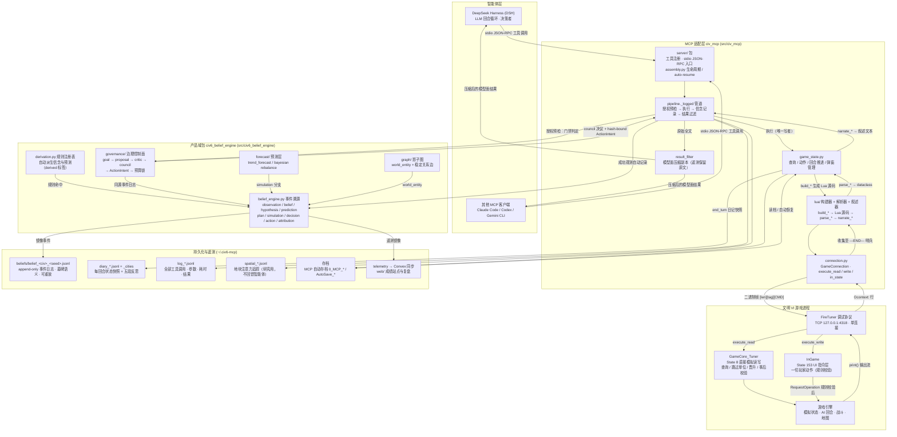
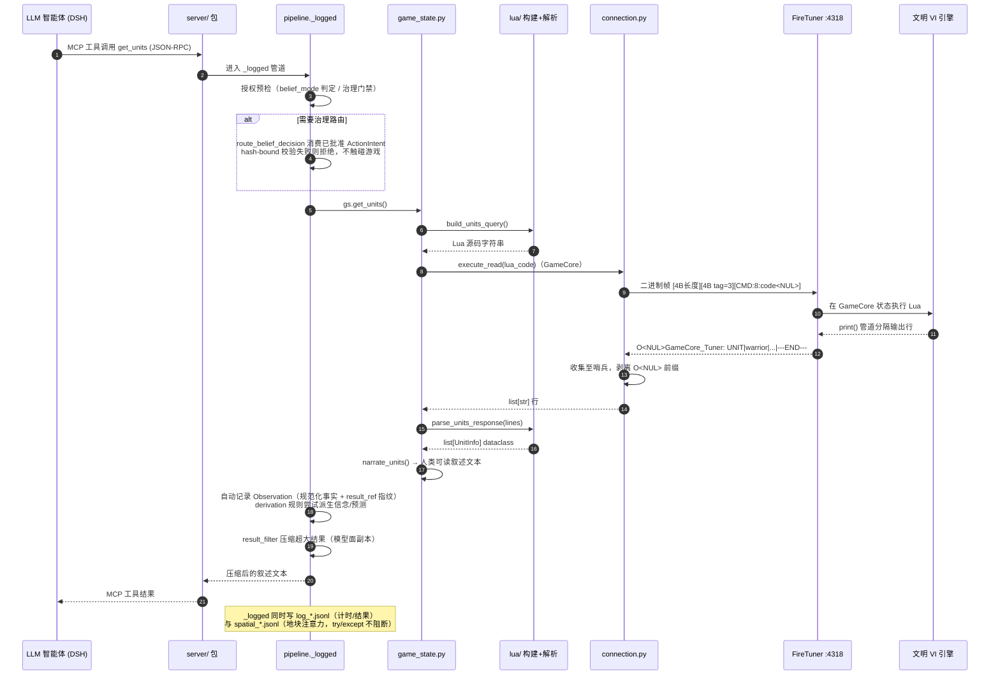
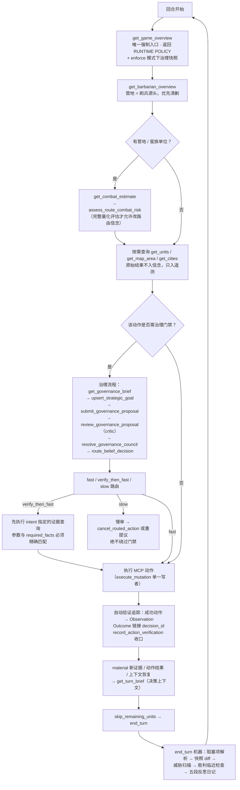

# 业务逻辑与数据流转总览（Mermaid）

本文用 Mermaid 图描述 `civ6-belief-engine` 的整体业务逻辑与数据流转。图例约定：

- **唯一运行链路**：`文明 VI → FireTuner 127.0.0.1:4318 → civ_mcp MCP 适配层 → DSH`。
- 数据遵循"观察 ≠ 信念"：原始结果归 transcript/遥测，信念引擎只保存规范化事实、指纹与关联。
- 所有游戏动作必须经过治理门禁与游戏自身规则校验，写游戏只有单一写者（`execute_mutation` 通道）。

---

## 1. 系统全景数据流

端到端数据流：LLM 智能体发起 MCP 工具调用 → 授权预检 → 生成 Lua → 经 FireTuner 进游戏执行 → 解析叙述返回；同时旁路记录信念事件与三类遥测流。

**读路径（查询）**：`DSH → SRV → PIPE → GS → LUA(构建) → CONN → FT → GameCore → 引擎`，返回路径 `引擎 → FT → CONN → LUA(解析) → GS(叙述) → PIPE → RF(压缩) → DSH`。

**写路径（动作）**：`DSH → SRV → PIPE(授权预检：必须持有已批准 ActionIntent) → GS → LUA → CONN → FT → InGame(规则校验) → 引擎`，`execute_mutation` 保证恰好发送一次，结果未知时抛 `MutationOutcomeUnknownError`，先读回验证再重试。

---

## 2. 一次工具调用的完整旅程（时序）

以 `get_units` 为例，查询工具遵循"构建 → 执行 → 解析 → 叙述"四步模式：

---

## 3. 每回合业务循环与门禁

回合级数据流：回合强制入口 → 威胁评估 → 决策门禁 → 执行 → 回合简报 → 推进：

**硬规则**：`get_game_overview` 读取成功前不得执行动作或 `end_turn`；返回 `BELIEF_GATE_REQUIRED` 时按精确 intent 完成路由后只重试一次；`bypassed` 模式不调用路由工具。

---

## 4. 治理控制面数据流（提案 → 决议 → 执行）

治理层与信念引擎共用同一事件日志，不另设状态存储；各部委只能提交建议，不能写游戏：

```mermaid
flowchart LR
    SNAP["typed GameState 快照<br/>GameOverview / CityInfo / UnitInfo / CivInfo"]
    SNAP --> ENT["world_entity / 关系 / 指标"]
    ENT --> GOAL["upsert_strategic_goal<br/>国家目标"]
    GOAL --> PROP["部委 submit_governance_proposal<br/>约束 · 预算锁 · 收益/成本 · 机会成本<br/>+ 显式 action_intents"]
    PROP --> CRIT["review_governance_proposal<br/>critic：agree / agree_with_conditions / object<br/>object 必须引用 Observation 或给出替代方案"]
    CRIT --> COUNCIL["resolve_governance_council<br/>固定顺序：硬约束 → critic 条件 →<br/>预算锁 → 战略优先级 → Pareto 支配 →<br/>机会成本（无加权总分）"]
    COUNCIL --> ROUTE["route_belief_decision<br/>hash-bound ActionIntent + evidence_requirements"]
    ROUTE -->|authorized| WRITER["单一游戏写者<br/>execute_mutation 通道"]
    WRITER --> OUT["Outcome + Observation<br/>+ 信念复核"]
    OUT -->|slow 审失效 / 重试不理性| CANCEL["cancel_routed_action<br/>追加 cancelled 未执行 Outcome"]
    OUT -->|客户端断开 / outcome_unknown| VERIFY["record_action_verification<br/>读回验证后收口"]
```

---

## 5. 持久化数据流总表

| 数据 | 文件（`~/.civ6-mcp/`） | 生产者 | 消费者 | 用途 |
|---|---|---|---|---|
| 信念事件日志 | `beliefs/belief_{civ}_{seed}.jsonl` | `pipeline._logged` / 信念工具 / derivation | `get_belief_trace` / coverage 审计 / dashboard | 世界模型与预测评分，append-only + 墓碑 |
| 日记 | `diary_*.jsonl` + `_cities` | `end_turn` | `get_diary` 上下文恢复 | 每回合快照 + 五段反思 |
| 工具日志 | `log_*.jsonl` | `_logged` 钩子 | 分析 / 复盘 | 权威行为记录（含原始结果全文） |
| 空间注意力 | `spatial_*.jsonl` | `_logged` 钩子 | 传感器效应研究 | 不回流智能体 |
| 存档 | `0_MCP_*` / `AutoSave_*` | autosave / 手动 | 崩溃恢复 / 读档（epoch 作废旧授权） | 恢复点 |
| 遥测 | telemetry → Convex | 信念事件镜像 | `web/` 成绩站点 | 跨游戏分析 |
