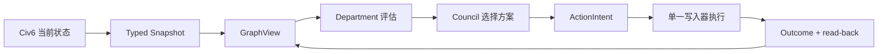

# Civ6 Belief Engine 图工程方案

> 图不是目标。目标是让 AI 的每个关键动作都能回答：看见了什么、为什么这样判断、为什么这样行动、结果是否符合预期。

本文件只保留当前有效方案；历史由 Git 与测试保存。

## 1. 目标与非目标

图工程解决四个问题：

1. 区分事实、推断、目标、决策和结果。
2. 保存它们之间的证据与因果关系。
3. 让动作只能通过明确授权执行。
4. 让结果能够反向修正判断和计划。

第一版不做：

- 不引入 Neo4j、LangGraph、消息队列或通用图框架。
- 不把 FireTuner、Lua、OCR、启动器和存档管理图化。
- 不建设没有真实消费者的通用图查询 DSL。
- 不改变 `civ_mcp`、`civ-mcp`、`mcp__civ6__*` 等兼容接口。

## 2. 整体流程

系统只保留一条闭环：



三层所有权不能混淆：

| 层 | 权威内容 | 说明 |
|---|---|---|
| `GameState` | Civ6 当前事实 | 当前局面最终以游戏查询为准 |
| JSONL event journal | 历史事实与审计 | 只追加，可以重放 |
| `GraphView` | 当前决策视图 | 由事件物化，可随时重建 |

Telemetry 继续保存原始诊断结果；图只保存规范化事实和结果引用，不复制大段原始文本。

## 3. 实体与关系

只有满足以下至少一个条件的对象才成为实体：有稳定身份、有独立生命周期、会被多处引用、需要单独查询或审计。

### 实体

| 类别 | 第一版实体 |
|---|---|
| 世界 | `Player`、`City`、`Unit`、`Tile`、`Technology`、`Civic`、`ResourceStockpile` |
| 认知 | `Observation`、`Belief`、`Goal` |
| 治理 | `Workstream`、`Proposal`、`CouncilDecision`、`ActionIntent`、`BudgetLock` |
| 执行 | `Action`、`Outcome` |

Department、Council、Snapshot、Event、GraphDelta 是组件或消息，不是实体。金币、人口、概率等普通数值是属性，不单独建节点。

实体 ID 必须与可变关系分离：

- 城市 ID 不包含 owner；城市易主只更新 `OWNS` 关系。
- epoch 不进入世界实体 ID；epoch 表示事实所属的时间分支。
- 己方与对手统一使用 `Player`，文明和领袖是属性。

### 关系

| 关系族 | 关系 |
|---|---|
| 世界 | `OWNS`、`LOCATED_AT`、`RESEARCHING`、`DIPLOMACY_WITH` |
| 证据 | `OBSERVES`、`SUPPORTS`、`CONTRADICTS`、`DERIVED_FROM` |
| 目标 | `SERVES`、`DEPENDS_ON`、`BLOCKED_BY`、`RESERVES` |
| 治理与执行 | `SELECTS`、`AUTHORIZES`、`EXECUTES`、`PRODUCES`、`VERIFIED_BY` |

一条动态关系至少包含：来源、目标、类型、epoch、有效回合、观察来源和属性。

关系只保存一份规范 Edge。incoming/outgoing 邻接表由 `GraphView` 生成，不在两个节点中各复制一份。

## 4. 通信与路由

实体不互相调用。组件只使用三种消息：

| 消息 | 用途 | 约束 |
|---|---|---|
| Query | 读取当前视图或历史 | 无副作用，可以重试 |
| Command | 请求一次状态变化 | 只有一个 handler |
| Event | 记录已经发生的事实 | 不可变、可重放 |

### 查询路由

- 当前决策上下文：读取 `GraphView`。
- 当前精确游戏值：查询 `GameState`，再写入 Observation。
- 历史追溯：读取 event journal。
- 原始工具结果：读取 Telemetry 引用。

`GraphView` 不得在查询内部偷偷访问 FireTuner。证据不足时返回 `EvidenceRequirement`，由上层显式补查。

### 决策与动作路由

Council 负责“选哪个方案”；RiskRouter 只负责“如何安全执行”。两者不能合并。

| 路由 | 含义 |
|---|---|
| `routine` | 只读或明确低影响动作，记录后执行 |
| `fast` | 当前证据和授权已满足 |
| `verify_then_fast` | 先补精确证据，再检查同一 ActionIntent |
| `slow` | 禁止执行，补证据或重新规划 |

所有游戏变异最终进入同一个 `ActionPipeline`：

```text
ActionIntent
→ 校验 turn / arguments_hash / evidence / budget
→ 单一游戏写入器
→ Outcome
→ 专用 read-back
→ EventJournal
→ GraphView
```

`ActionIntent` 只有一个规范形：`governance/models.py` 中的不可变类型。JSONL 中的 dict 只是序列化形式。

## 5. 当前代码如何演进

| 当前实现 | 目标职责 |
|---|---|
| `GameState` | 保持 Civ6 类型化适配层和当前事实入口 |
| `snapshot_world_state()` | 收敛为纯 `GraphProjector` |
| `BeliefEngine` | 保留事件兼容；逐步分离 journal、materializer 和授权状态机职责 |
| Departments | 只读取窄 `GraphView` 查询，输出 Assessment/Proposal |
| Governance Council | 只处理约束、预算和方案选择 |
| `_logged` / action gate | 收敛为 `ActionPipeline` |
| `server.py` | 最后瘦身，只负责 MCP 工具注册和依赖装配 |

建议的最小目录：

```text
src/civ6_belief_engine/graph/
  model.py       # Node / Edge / GraphDelta
  project.py     # snapshot + prior view -> delta
  replay.py      # events -> current view
  view.py        # 真实消费者需要的窄查询
```

没有实际职责的文件不创建。

## 6. 最小迁移路径

采用“影子投影 → 单消费者切换 → 删除旧路径”，不做全量重写。

### 阶段一：建立影子图

- 冻结 MCP 工具签名、ActionIntent、epoch 和 replay 行为。
- 定义稳定 Node、Edge、GraphDelta 与 GraphView。
- 同一 snapshot 同时走旧投影与影子投影，只比较结果。
- 为不同数据声明覆盖语义：完整、仅当前可见、历史已知或摘要。

当前已完成：纯 `graph` 包、旧/新投影比较、`graph.delta` 事件回放、game/epoch 隔离及覆盖语义测试。旧 BeliefEngine 投影仍是运行兼容面；影子图失败只报告错误，不阻断原链路。

### 阶段二：贯通一个真实切片

第一条切片只做“城市周边威胁”：

```text
Threat typed data
→ City / Unit / Tile 图
→ threats_near_city()
→ Military Proposal
→ CouncilDecision
→ ActionIntent
→ 一个防御动作
→ read-back Outcome
```

当前已完成离线闭环：

- 威胁扫描显式区分失败、确认空结果和非空结果；和平单位不生成 `THREATENS`。
- Lua 返回每座己方城市的六边格距离；`unit_id=0` 仍是有效身份。
- `TurnSnapshot`、影子图和 `threats_near_city()` 已贯通，失去视野后默认不再作为当前威胁。
- Military 只生成一个可验证的原地 `fortify` Proposal；Council、ActionIntent 和现有单写入器继续复用。
- 显式 `EvidenceRequirement` 必定经过 `verify_then_fast`，并核对守军仍在原城市格；fortify 无可观察状态变化时返回 `OUTCOME_UNKNOWN`。

真实游戏已验证同回合快照、威胁空结果、影子图零差异和 fortify 状态读取。当前局面没有城市周边敌军，因此尚未完成真实的 Proposal → 动作 → Outcome 验收。

### 阶段三：迁移一个消费者

- GraphView 先提供活动 Goal、priority 和 statement 查询。
- 只迁移 Military Department。
- 等价测试通过后，删除该消费者的旧读取路径。

当前已完成：

- active Goal 在治理快照边界由 JSONL 投影进同一 GraphView；Goal 更新、归档和 replay 保持确定性，内容未变化时不追加 Goal delta。
- Military 在有图时只读取同一 snapshot/turn 的 Graph Goal 与 `THREATENS`；不再回退 `context.agenda` 或 `context.goals`。
- 陈旧图只能触发证据缺口，不能影响当前威胁判断、Proposal 或复盘结论。
- 防御 Proposal 必须绑定一个语义相关的军事/防御 Goal，不能借用任意最高优先级 Goal。
- Military 源码已移除对 `civ_mcp.lua.models` 的直接导入，先用窄 Protocol 固定所需字段。

尚未迁移：蛮族营地、己方单位与其他军事事实仍来自兼容 TurnSnapshot；它们在模型层仍间接携带 Lua DTO。因此这里只能称为“Goal + Threat 单消费者迁移完成”，不能称为整个 Department 已解耦。

### 阶段四：逐步扩展

- 按真实需求增加关系和专用查询。
- 新图成为唯一写路径后，立即删除旧双写。
- `server.py` 已于 2026-08-15 拆分为 `server/` 包（move-only）：`assembly.py` 装配、`pipeline.py` 运行管道（未来 ActionPipeline）、`tools/` 按域分组工具。阶段四删除旧 belief/governance 适配层 = 整删 `tools/belief.py` + `__init__.py` 对应再导出；`end_turn.py` 拆分仍留到本阶段。
- 只有出现实测性能瓶颈，才评估外部图存储。

## 7. ETC 与风险门禁

ETC 的判断标准只有一句：一个需求变化只修改拥有该知识的边界。

例如新增 `THREATENS`，应只修改关系定义、projector 和测试，不应修改 MCP、FireTuner、所有 Department 和存储实现。

迁移前必须验证四个基本假设：

| 假设 | 最小验证 |
|---|---|
| 数据足够真实 | 敌军出现、进入迷雾、再次出现；中间只能是 unknown，不能是 deleted |
| ID 与时间正确 | 城市易主、单位重建和 reload 后，当前分支不读取旧分支事实 |
| 图确实有价值 | 与旧路径比较错误动作、重复查询和人工纠正次数 |
| 人能够理解 | 每个动作能用五句话说明：看见、判断、选择、执行、验证 |

出现以下任一情况就停止扩大图工程：

1. 同一输入在旧路径和图路径得到不同关键结论。
2. “未观察”仍可能被当作“已删除”。
3. reload 后旧 epoch 仍影响当前决策。
4. 变异结果未知时仍会自动重试。
5. 一个动作无法 read-back，或无法解释其证据链。

城市影子 ID 暂以城市中心坐标跨越 owner 变化；当前 DTO 无法区分“原城被夷平”与“同一地块后来重建”。完成阶段二真实动作验收前，必须补充城市 lineage/销毁信号或用真实游戏证明可替代身份。

仍未关闭的边界：

- 当前真实存档没有可见城市威胁，不能替代带敌军场景的动作验收。
- TurnSnapshot 仍间接依赖 `civ_mcp.lua.models`；Military 的直接 import 已删除，但最终 DTO 边界尚未完成。
- Proposal、Decision、Action 和 Outcome 仍由现有 JSONL 治理状态保存，尚未物化为图关系。
- Claude Code 的整份 diff 审查多次超时；拆成可核验问题后发现“陈旧 Threat 污染只读评估”和“任意 Goal 为防御提案背书”两项共识缺陷，均已修复并通过定向复核。超时的审查不计为通过证据。

## 8. 验收标准

验收分三层，不能相互替代：

1. **离线**：投影确定性、replay hash、epoch、悬空边、失败注入和旧 JSONL 兼容。
2. **组合**：MCP 工具 schema、DSH 配置、兼容导入和结果过滤保持可用。
3. **真实游戏**：完成一次读取、提案、授权、动作、read-back、end_turn 和 reload/断线恢复。

第一版完成的判据：

- 一个真实动作能追溯到 Observation、Goal、Proposal、Decision、ActionIntent、Action 和 Outcome。
- 同一事件流可以重建相同 GraphView。
- Department 不依赖 MCP/Lua 类型。
- 旧 MCP 客户端和历史 JSONL 继续可用。
- 影子切片相对旧路径有可测量收益；否则不继续扩张。

最终原则：**先证明一个最小闭环，再增加第二个实体、关系或消费者。**

---

# 对 Codex 图工程改造的对抗式审查（2026-08-15，基线 21ccb31 / 307 passed → 审查时 338 passed）

审查范围：`8dc5b15`（影子图）、`96c8127`（威胁治理切片）、`f922cb5`（防御证据绑定）、`70c1a8c`（军事 Goal 迁移），共 25 文件 +3119/-105。方法：逐文件读穿 `graph/` 包与集成点，用真实游戏日志（`belief_france_2126806272.jsonl`，含 Codex 真机验证写入的 graph.delta）量化验尸假设，按"3 小时事前验尸"时间线组织发现。

## 核验通过的关键声明

| README 声明 | 代码证据 |
|---|---|
| 影子图失败只报告不阻断 | `_capture_governance_snapshot` try/except，legacy 路径不受影响 |
| 未观察 ≠ 已删除 | `project.py`：COMPLETE→remove，CURRENTLY_VISIBLE/KNOWN_HISTORY→`observed=False` |
| 城市 ID 不含 owner | `city:{x}:{y}` 中心坐标 + KNOWN_HISTORY；raze-resettle 缺口已诚实标注 |
| Goal 内容不变不追加 delta | `project_active_goals` 内容哈希去重（真实日志零 goal delta ✓） |
| Military 不再 import Lua DTO、不回退 agenda | Protocol 类型隔离；图在时只读 Graph Goal + THREATENS |
| 陈旧图只触发证据缺口 | `_graph_is_current` 双条件（snapshot_id+turn），陈旧→评估退化不影响威胁判断 |
| EvidenceRequirement 必经 verify_then_fast | `route_decision` 强制提升 + 真实提案以 `expected_facts` 绑定守军坐标 |
| epoch 隔离 | reload 清空图视图、replay 按 epoch 过滤、`apply` 跨 epoch 重置 |
| 基线测试诚实 | parsers 断言只增不减；MCP 工具签名零变更 |

结论：**改造质量高、自我披露诚实**（README 的"尚未完成"账本与代码一致）。以下为验尸发现，按死亡时间排序。

## 3 小时验尸发现

### V1（T+1h~3h，高）：graph.delta 全量 upsert → 写放大翻倍 + 回放平方复杂度

实测：turn 2 仅 16 实体，一个 graph.delta = **14,601 字节**；`project_world_state` 每回合 upsert **全部**当前节点（`upsert_nodes = list(current_nodes.values())`），与旧 world_entity 事件构成双份全量写。中局 ~100 实体时每次 `get_governance_brief` 额外 ~100KB 落盘；300 回合长局 JSONL 增长数十 MB。更隐蔽的是 `replay_graph_events` 对每个 delta 后的**全视图**做 `state_hash` 校验——N 个 delta × 递增视图 = **O(N²)** 重放成本，进程重启（崩溃恢复后必然发生）时显著变慢。Goal 投影已做内容去重，世界投影没有——对称性缺失。阶段三"事件增量化"本就是共识方向，此项应提前。

### V2（T+10m~1h，中）：威胁扫描失败 = 整个治理快照失败

`get_governance_snapshot` 中 `threats = await self.get_threat_scan()` **无独立降级**：扫描 Lua 一次超时（注意 `CommandTimeoutError` 现在对查询默认严格 sentinel）即整个快照抛错 → 每回合 `get_governance_brief` 全红，agent 完全失去治理视野。fail-closed 可辩护（不能谎称城市安全），但部门层已写好的 `threat_scan_available=False` 降级分支在真实采集路径下是**死代码**（build 侧 None 语义从未被采集路径触发）。一次 Lua 格式漂移的代价从"评估降级"放大为"视野全失"。

### V3（T+0~10m，中低）：采集序列加长 + 新查询的 sentinel 脆弱性

治理快照现为 11 个串行 FireTuner 往返（+threat scan），每回合 `get_governance_brief` 变慢；threat scan 经 `execute_read` 严格 sentinel——真机验证过一次空结果，但 Civ6 更新或 Lua 环境差异会让它与 V2 叠加成"开局即全红"。

### V4（低）：graph.delta 事件 ID 可重复

world delta 与 goal delta 共用 `graph_delta:{epoch}:{snapshot_id}`——同回合两个事件同 ID。`_reduce` 不消费该类型故无状态冲突，但审计检索会混淆。加 `:world`/`:goal` 后缀即可。

### V5（低）：城市 ID 构造规则散落两处

`project._entity_identity` 定义 `city:{x}:{y}`，`military._nearby_threats` 重复硬编码同一格式。按 §7 自己的 ETC 标准（新增关系只改一处），ID 构造应收敛为 graph 包导出的单一函数，否则未来改 ID 方案要同步改军事部。

## 共识部分：融合优化方案（双方意见一致，可直接实施）

1. **世界投影内容去重（修 V1 主体）**：把 `project_active_goals` 的去重模式移植到 `project_world_state`——attributes 与 observed 均未变的节点/边不进 upsert。不改 schema、不改 replay 语义，预期把每回合 graph.delta 从全量降到真实变化量（稳态回合可接近零）；replay 的 O(N²) 随之缓解。
2. **威胁扫描独立降级（修 V2/V3）**：采集处 try/except → `threats=None`，激活部门层已存在的降级分支——fail-degraded 优于 fail-blind，军事评估退化为"不能认定安全"而非整个治理面消失。
3. **ActionIntent 规范形落地路径**（README §4 已声明"规范形 = models.py 不可变类型"）：短期在 `route_belief_decision` 服务端将 action_intent dict 解析为 `ActionIntent` 类型校验后序列化回存（单一校验点）；长期授权状态机直接消费类型。列为阶段四前置，不阻塞当前切片。

## 分歧项（留用户裁决）

**威胁扫描的失败哲学**：Codex 的实现是"全有或全无"（扫描失败→快照失败→fail-closed）；本审查建议 fail-degraded（上面共识 2）。防御语义上两者都可辩护——前者绝不基于残缺扫描判断安全，后者保住治理视野但军事评估降级。裁决点：**一次 Lua 超时时，你希望 agent 看到什么**——完整的错误（被迫修复后继续），还是降级的治理简报（继续行动但军事结论保守）？

## 审查结论

方向、纪律、实现质量均属上乘；自我披露的"尚未完成"边界与代码事实一致。V1 是唯一必须在扩张前修复的项（它直接违背 §8"影子切片有可测量收益"的判据——当前收益为负值：双倍写放大换零消费者差异告警）；V2/V3 建议同批修复；V4/V5 顺手项。修复 V1-V3 后，阶段二的"真实动作验收"（README 自认未完成）应作为下一个门禁，而非继续扩张切片。

## 审查后修复记录（2026-08-15，用户裁决 V2 采用 fail-degraded）

全部共识项已实施，342 passed（338 + 4 新回归）：

- **V1 写放大（修复）**：`project_world_state` 移植 Goal 投影的内容去重——attributes/coverage/observed 均未变的节点与边不再进 upsert（观察标志翻转始终写入）。稳态回合的 graph.delta 从全量实体降至接近零字节；replay 的 O(N²) 哈希成本随之缓解。配套：`compare_shadow_projection` 的观察集判定从 `last_observed_turn == turn` 改为纯 observed 集合等价（去重后未变实体保留较早的 last_observed_turn，该字段语义变为"最后写入回合"）。注意：世界 delta 仍无条件记录（空 delta 也推进 snapshot_id/turn 标记，否则军事部的同回合图判定会误报陈旧）。
- **V2 威胁扫描 fail-degraded（修复，用户裁决 B）**：`get_governance_snapshot` 对 `get_threat_scan` 单独 try/except（LuaError/ValueError → `threats=None`，连接级失败仍快速失败）——激活部门层原有的 `threat_scan_available=False` 降级分支（原为死代码）。扫描失败时治理简报照常返回，军事评估降级为"不能认定城市安全"。
- **V4 delta 事件 ID（修复）**：`record_graph_delta` 增加 `kind` 参数（world/goals），事件 ID 与 payload 均带流标识，同快照双 delta 不再同 ID。
- **V5 城市 ID 单点（修复）**：`city_node_id()` 收敛进 `graph/project.py` 并导出；军事部改用该函数，不再本地拼接格式。
- **共识项 3（ActionIntent 单点校验）**：核验发现 Codex 已在 `route_belief_decision` 完整实现（规范化参数 → 校验提供的哈希 → 回填计算哈希 → ruleset 能力校验），无需改动。
- 新增回归：去重（含影子对比不依赖 last_observed_turn）、迷雾往返在去重下的 observed 恢复、扫描失败降级、kind ID 唯一性。

V3（采集序列长度）未单独处理——威胁扫描降级后其失败模式已从"全红"降为"降级"，剩余影响只是每回合固定延迟，留待阶段四执行图化统一编排。
