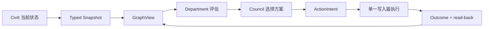

# Civ6 Belief Engine 图工程方案

> 图不是目标。目标是让 AI 的每个关键动作都能回答：看见了什么、为什么这样判断、为什么这样行动、结果是否符合预期。

本文件只保留当前有效方案；历史由 Git 与测试保存。

## 1. 目标与非目标

图工程解决四个问题：

1. 区分事实、推断、目标、决策和结果。
2. 保存它们之间的证据与因果关系。
3. 让动作只能通过明确授权执行。
4. 让结果能够反向修正判断和计划。

第一版不做：

- 不引入 Neo4j、LangGraph、消息队列或通用图框架。
- 不把 FireTuner、Lua、OCR、启动器和存档管理图化。
- 不建设没有真实消费者的通用图查询 DSL。
- 不改变 `civ_mcp`、`civ-mcp`、`mcp__civ6__*` 等兼容接口。

## 2. 整体流程

系统只保留一条闭环：



三层所有权不能混淆：

| 层 | 权威内容 | 说明 |
|---|---|---|
| `GameState` | Civ6 当前事实 | 当前局面最终以游戏查询为准 |
| JSONL event journal | 历史事实与审计 | 只追加，可以重放 |
| `GraphView` | 当前决策视图 | 由事件物化，可随时重建 |

Telemetry 继续保存原始诊断结果；图只保存规范化事实和结果引用，不复制大段原始文本。

## 3. 实体与关系

只有满足以下至少一个条件的对象才成为实体：有稳定身份、有独立生命周期、会被多处引用、需要单独查询或审计。

### 实体

| 类别 | 第一版实体 |
|---|---|
| 世界 | `Player`、`City`、`Unit`、`Tile`、`Technology`、`Civic`、`ResourceStockpile` |
| 认知 | `Observation`、`Belief`、`Goal` |
| 治理 | `Workstream`、`Proposal`、`CouncilDecision`、`ActionIntent`、`BudgetLock` |
| 执行 | `Action`、`Outcome` |

Department、Council、Snapshot、Event、GraphDelta 是组件或消息，不是实体。金币、人口、概率等普通数值是属性，不单独建节点。

实体 ID 必须与可变关系分离：

- 城市 ID 不包含 owner；城市易主只更新 `OWNS` 关系。
- epoch 不进入世界实体 ID；epoch 表示事实所属的时间分支。
- 己方与对手统一使用 `Player`，文明和领袖是属性。

### 关系

| 关系族 | 关系 |
|---|---|
| 世界 | `OWNS`、`LOCATED_AT`、`RESEARCHING`、`DIPLOMACY_WITH` |
| 证据 | `OBSERVES`、`SUPPORTS`、`CONTRADICTS`、`DERIVED_FROM` |
| 目标 | `SERVES`、`DEPENDS_ON`、`BLOCKED_BY`、`RESERVES` |
| 治理与执行 | `SELECTS`、`AUTHORIZES`、`EXECUTES`、`PRODUCES`、`VERIFIED_BY` |

一条动态关系至少包含：来源、目标、类型、epoch、有效回合、观察来源和属性。

关系只保存一份规范 Edge。incoming/outgoing 邻接表由 `GraphView` 生成，不在两个节点中各复制一份。

## 4. 通信与路由

实体不互相调用。组件只使用三种消息：

| 消息 | 用途 | 约束 |
|---|---|---|
| Query | 读取当前视图或历史 | 无副作用，可以重试 |
| Command | 请求一次状态变化 | 只有一个 handler |
| Event | 记录已经发生的事实 | 不可变、可重放 |

### 查询路由

- 当前决策上下文：读取 `GraphView`。
- 当前精确游戏值：查询 `GameState`，再写入 Observation。
- 历史追溯：读取 event journal。
- 原始工具结果：读取 Telemetry 引用。

`GraphView` 不得在查询内部偷偷访问 FireTuner。证据不足时返回 `EvidenceRequirement`，由上层显式补查。

### 决策与动作路由

Council 负责“选哪个方案”；RiskRouter 只负责“如何安全执行”。两者不能合并。

| 路由 | 含义 |
|---|---|
| `routine` | 只读或明确低影响动作，记录后执行 |
| `fast` | 当前证据和授权已满足 |
| `verify_then_fast` | 先补精确证据，再检查同一 ActionIntent |
| `slow` | 禁止执行，补证据或重新规划 |

所有游戏变异最终进入同一个 `ActionPipeline`：

```text
ActionIntent
→ 校验 turn / arguments_hash / evidence / budget
→ 单一游戏写入器
→ Outcome
→ 专用 read-back
→ EventJournal
→ GraphView
```

`ActionIntent` 只有一个规范形：`governance/models.py` 中的不可变类型。JSONL 中的 dict 只是序列化形式。

## 5. 当前代码如何演进

| 当前实现 | 目标职责 |
|---|---|
| `GameState` | 保持 Civ6 类型化适配层和当前事实入口 |
| `snapshot_world_state()` | 收敛为纯 `GraphProjector` |
| `BeliefEngine` | 保留事件兼容；逐步分离 journal、materializer 和授权状态机职责 |
| Departments | 只读取窄 `GraphView` 查询，输出 Assessment/Proposal |
| Governance Council | 只处理约束、预算和方案选择 |
| `_logged` / action gate | 收敛为 `ActionPipeline` |
| `server.py` | 最后瘦身，只负责 MCP 工具注册和依赖装配 |

建议的最小目录：

```text
src/civ6_belief_engine/graph/
  model.py       # Node / Edge / GraphDelta
  project.py     # snapshot + prior view -> delta
  replay.py      # events -> current view
  view.py        # 真实消费者需要的窄查询
```

没有实际职责的文件不创建。

## 6. 最小迁移路径

采用“影子投影 → 单消费者切换 → 删除旧路径”，不做全量重写。

### 阶段一：建立影子图

- 冻结 MCP 工具签名、ActionIntent、epoch 和 replay 行为。
- 定义稳定 Node、Edge、GraphDelta 与 GraphView。
- 同一 snapshot 同时走旧投影与影子投影，只比较结果。
- 为不同数据声明覆盖语义：完整、仅当前可见、历史已知或摘要。

当前已完成：纯 `graph` 包、旧/新投影比较、`graph.delta` 事件回放、game/epoch 隔离及覆盖语义测试。旧 BeliefEngine 投影仍是运行兼容面；影子图失败只报告错误，不阻断原链路。

### 阶段二：贯通一个真实切片

第一条切片只做“城市周边威胁”：

```text
Threat typed data
→ City / Unit / Tile 图
→ threats_near_city()
→ Military Proposal
→ CouncilDecision
→ ActionIntent
→ 一个防御动作
→ read-back Outcome
```

当前已完成离线闭环：

- 威胁扫描显式区分失败、确认空结果和非空结果；和平单位不生成 `THREATENS`。
- Lua 返回每座己方城市的六边格距离；`unit_id=0` 仍是有效身份。
- `TurnSnapshot`、影子图和 `threats_near_city()` 已贯通，失去视野后默认不再作为当前威胁。
- Military 只生成一个可验证的原地 `fortify` Proposal；Council、ActionIntent 和现有单写入器继续复用。
- 显式 `EvidenceRequirement` 必定经过 `verify_then_fast`，并核对守军仍在原城市格；fortify 无可观察状态变化时返回 `OUTCOME_UNKNOWN`。

真实游戏已验证同回合快照、威胁空结果、影子图零差异和 fortify 状态读取。当前局面没有城市周边敌军，因此尚未完成真实的 Proposal → 动作 → Outcome 验收。

### 阶段三：迁移一个消费者

- GraphView 先提供活动 Goal、priority 和 statement 查询。
- 只迁移 Military Department。
- 等价测试通过后，删除该消费者的旧读取路径。

当前已完成：

- active Goal 在治理快照边界由 JSONL 投影进同一 GraphView；Goal 更新、归档和 replay 保持确定性，内容未变化时不追加 Goal delta。
- Military 在有图时只读取同一 snapshot/turn 的 Graph Goal 与 `THREATENS`；不再回退 `context.agenda` 或 `context.goals`。
- 陈旧图只能触发证据缺口，不能影响当前威胁判断、Proposal 或复盘结论。
- 防御 Proposal 必须绑定一个语义相关的军事/防御 Goal，不能借用任意最高优先级 Goal。
- Military 源码已移除对 `civ_mcp.lua.models` 的直接导入，先用窄 Protocol 固定所需字段。

尚未迁移：蛮族营地、己方单位与其他军事事实仍来自兼容 TurnSnapshot；它们在模型层仍间接携带 Lua DTO。因此这里只能称为“Goal + Threat 单消费者迁移完成”，不能称为整个 Department 已解耦。

### 阶段四：逐步扩展

- 按真实需求增加关系和专用查询。
- 新图成为唯一写路径后，立即删除旧双写。
- 最后才拆 `server.py` 和 `end_turn.py`。
- 只有出现实测性能瓶颈，才评估外部图存储。

## 7. ETC 与风险门禁

ETC 的判断标准只有一句：一个需求变化只修改拥有该知识的边界。

例如新增 `THREATENS`，应只修改关系定义、projector 和测试，不应修改 MCP、FireTuner、所有 Department 和存储实现。

迁移前必须验证四个基本假设：

| 假设 | 最小验证 |
|---|---|
| 数据足够真实 | 敌军出现、进入迷雾、再次出现；中间只能是 unknown，不能是 deleted |
| ID 与时间正确 | 城市易主、单位重建和 reload 后，当前分支不读取旧分支事实 |
| 图确实有价值 | 与旧路径比较错误动作、重复查询和人工纠正次数 |
| 人能够理解 | 每个动作能用五句话说明：看见、判断、选择、执行、验证 |

出现以下任一情况就停止扩大图工程：

1. 同一输入在旧路径和图路径得到不同关键结论。
2. “未观察”仍可能被当作“已删除”。
3. reload 后旧 epoch 仍影响当前决策。
4. 变异结果未知时仍会自动重试。
5. 一个动作无法 read-back，或无法解释其证据链。

城市影子 ID 暂以城市中心坐标跨越 owner 变化；当前 DTO 无法区分“原城被夷平”与“同一地块后来重建”。完成阶段二真实动作验收前，必须补充城市 lineage/销毁信号或用真实游戏证明可替代身份。

仍未关闭的边界：

- 当前真实存档没有可见城市威胁，不能替代带敌军场景的动作验收。
- TurnSnapshot 仍间接依赖 `civ_mcp.lua.models`；Military 的直接 import 已删除，但最终 DTO 边界尚未完成。
- Proposal、Decision、Action 和 Outcome 仍由现有 JSONL 治理状态保存，尚未物化为图关系。
- Claude Code 的整份 diff 审查多次超时；拆成可核验问题后发现“陈旧 Threat 污染只读评估”和“任意 Goal 为防御提案背书”两项共识缺陷，均已修复并通过定向复核。超时的审查不计为通过证据。

## 8. 验收标准

验收分三层，不能相互替代：

1. **离线**：投影确定性、replay hash、epoch、悬空边、失败注入和旧 JSONL 兼容。
2. **组合**：MCP 工具 schema、DSH 配置、兼容导入和结果过滤保持可用。
3. **真实游戏**：完成一次读取、提案、授权、动作、read-back、end_turn 和 reload/断线恢复。

第一版完成的判据：

- 一个真实动作能追溯到 Observation、Goal、Proposal、Decision、ActionIntent、Action 和 Outcome。
- 同一事件流可以重建相同 GraphView。
- Department 不依赖 MCP/Lua 类型。
- 旧 MCP 客户端和历史 JSONL 继续可用。
- 影子切片相对旧路径有可测量收益；否则不继续扩张。

最终原则：**先证明一个最小闭环，再增加第二个实体、关系或消费者。**
