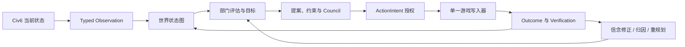

# Civ6 Belief Engine：图工程改造理解

## 一句话结论

这个项目要改造成的不是“使用图数据库的 Civ6 工具”，而是一个**以关系、证据和因果链为核心的智能体决策工程**：把分散的游戏状态、观察、信念、目标、决策、动作与结果组织成可追溯的图，并用一条确定、可验证的执行链驱动游戏。

图是解决问题的手段，不是目标。第一阶段不需要 Neo4j、LangGraph 或通用图框架；Python 数据结构、现有 JSONL 事件流和清晰的领域边界已经足够。

## 1. 从第一性原理重新定义问题

LLM 玩 Civ6 的核心困难不是“缺少更多工具”，而是以下四件事无法仅靠一段上下文稳定解决：

1. **世界是动态且部分可见的**：城市、单位、外交和资源每回合都在变化，战争迷雾意味着“没有看到”不等于“不存在”。
2. **事实、推断和计划容易混在一起**：工具结果是事实，信念是解释，计划是承诺，三者必须有不同的可信度和生命周期。
3. **一个动作依赖多条关系**：例如生产城墙，不只取决于城市能否生产，还取决于威胁、目标、资源锁、机会成本和治理授权。
4. **动作完成不等于目标达成**：每次执行都必须连接到前置证据、授权决策和后置验证，否则无法复盘或修正策略。

因此，图工程的根本目标是：

> 让智能体在每个回合都能回答“我知道什么、为什么相信、要实现什么、为什么这样行动、结果是否符合预期”。

## 2. 图工程在本项目中的准确含义

本项目只需要一张统一逻辑图，内部包含三个相互连接的子图。

| 子图 | 解决的问题 | 典型内容 |
|---|---|---|
| 世界状态图 | 当前观察到的世界是什么 | 玩家、城市、单位、地块、资源、外交关系 |
| 信念决策图 | 为什么形成某个判断与选择 | Observation、Belief、Goal、Proposal、Decision、Constraint |
| 执行验证图 | 一个决定如何安全落地并得到验证 | ActionIntent、Action、Outcome、Verification、Failure Attribution |

它们不应成为三套状态系统。世界状态提供事实，信念决策解释事实，执行验证检验解释，最终仍由同一个事件流记录变化。

## 3. 图中的最小语义

### 节点

- `WorldEntity`：玩家、城市、单位、地块、科技、资源等可稳定识别的游戏对象。
- `Observation`：某回合由某个工具直接获得的事实及来源指纹。
- `Belief`：基于 Observation 得出的可修正解释，包含概率、置信度和反证条件。
- `Goal`：希望达到的世界状态。
- `Proposal`：为 Goal 提出的候选方案。
- `Constraint`：规则、预算锁、前置证据或不可逆性限制。
- `Decision`：经过治理后被选择或拒绝的方案。
- `Action`：实际提交给游戏的写操作。
- `Outcome`：动作返回及后续状态变化。

### 边

- 世界关系：`OWNS`、`LOCATED_AT`、`AT_WAR_WITH`、`RESEARCHING`。
- 证据关系：`OBSERVES`、`SUPPORTS`、`CONTRADICTS`、`DERIVED_FROM`。
- 目标关系：`SERVES`、`DEPENDS_ON`、`BLOCKED_BY`、`RESERVES`。
- 执行关系：`SELECTS`、`AUTHORIZES`、`EXECUTES`、`PRODUCES`、`VERIFIES`。

节点和边都至少携带：稳定 ID、类型、回合、来源、状态和版本。只有推断类节点需要概率与置信度；观察事实不应伪装成概率判断。

## 4. 单一事实源

图工程最容易出现的错误，是建立第二套“看似更智能”的游戏状态。这里必须明确三层所有权：

1. **Civ6 实时状态**：当前游戏事实的最终权威，由 `GameState` 通过 FireTuner 查询。
2. **JSONL 事件流**：历史事实、决策和动作的审计权威，只追加，不原地改写历史。
3. **图快照与索引**：由事件和当前观察物化出的决策视图，可以重建，不是新的事实源。

DSH transcript 与 Telemetry 继续保存原始工具结果；图只保存规范化事实、引用指纹和实体关系，避免第三份原始数据副本。

## 5. 当前代码与目标职责的映射

| 当前实现 | 保留的价值 | 图工程中的目标职责 |
|---|---|---|
| `GameState` | 类型化游戏边界 | `GamePort` 的 Civ6 实现，仍是实时状态权威 |
| `snapshot_world_state()` | 已能生成实体、关系和指标 | 收敛为纯函数 `GraphProjector` |
| `BeliefEngine` | 事件追加、回放、墓碑语义 | 拆为 `GraphEventStore` 与 `GraphMaterializer` |
| 六个 Department | 独立策略评估 | 只读取 `GraphView`，输出候选目标与 workstream |
| Governance Council | 约束、预算锁、ActionIntent | 作为确定性决策节点，不直接执行游戏动作 |
| `_logged` | 公共授权、记录和错误边界 | 收敛为统一 Action Pipeline |
| `end_turn.py` | 回合安全与恢复经验 | 拆成可观测、可重试的执行步骤图 |
| `server.py` | 稳定 MCP 兼容面 | 只负责依赖装配和工具注册 |

兼容面保持不变：`civ_mcp`、`civ-mcp`、`mcp__civ6__*`、`APP:civ6-mcp` 和 `~/.civ6-mcp`。

## 6. 明确不图化的部分

根据奥卡姆剃刀，以下部分继续使用普通模块和函数：

- FireTuner TCP 协议、连接锁和重连。
- Lua builder、parser 与具体游戏 API 适配。
- 游戏启动、OCR、存档文件管理。
- Telemetry sink、Web API 和日志输出。
- 简单、无依赖、无治理要求的读取工具。

这些部分的复杂性来自协议或平台，不来自关系推理。强行图化只会增加节点数量和调试成本。

## 7. 最小改造路径

### 阶段一：固定边界

- 固定现有 MCP 工具名、参数、Runtime Policy 和旧导入路径。
- 修复默认 pytest 入口，建立可重复的离线基线。
- 将领域 DTO 从 `civ_mcp.lua.models` 移到产品领域包，倒置依赖方向。

### 阶段二：建立最小图核心

- 定义不可变的 `Node`、`Edge`、`GraphSnapshot`、`GraphDelta`。
- 将现有 typed snapshot 通过纯函数投影为图。
- 增加节点、边、邻接和按类型查询的内存索引。
- 校验稳定 ID、无悬空边、同回合一致性和确定性哈希。

### 阶段三：事件增量化

- 新事件只记录节点/边的新增、更新、归档和失效。
- 历史 JSONL 通过兼容读取器继续回放，不原地迁移。
- 为边增加有效回合和来源，使城市易主、单位死亡等变化可表达。

### 阶段四：执行图化

- 将 Department workstream、依赖、Council、ActionIntent、Action、Verification 连接成确定性 DAG。
- 只有带完成证据的依赖才能解除。
- 保持单写入器、参数哈希绑定、预算锁和 fail-closed 行为。
- 最后再拆小 `server.py` 与 `end_turn.py`，而不是先做文件搬家。

## 8. 必须守住的不变量

- 事实、推断、计划和结果不能混为一种节点。
- 图的任何结论都必须能追溯到 Observation 或明确规则。
- 图快照必须可以从事件流重建。
- 同一份输入必须产生相同的图 ID、投影和决策顺序。
- 一个真实游戏只能有一个 FireTuner 客户端和一个动作写入器。
- 高影响动作必须保留 Council 与 ActionIntent 授权。
- 离线测试、DSH 组合检查和真实游戏验收必须分别报告。

## 9. 主要盲点与预防

- **战争迷雾**：节点未被本回合观察到，不等于节点已不存在；需要 `last_observed_turn` 和过期策略。
- **时间关系**：外交、占领和位置边必须有有效期，不能只覆盖最新值。
- **图膨胀**：不是每条日志都成为节点；只有会参与查询、决策或审计的对象进入图。
- **断线后的不确定结果**：Action 必须允许 `executing -> verified/retryable`，不能因客户端超时重复执行。
- **策略伪精确**：概率与置信度是不同概念，不能合成一个“综合评分”替代约束判断。
- **框架绑架设计**：先证明查询和执行需求，再决定是否需要外部图数据库或图运行框架。

## 10. 完成标准

图工程第一版完成，不以“目录中出现 graph 文件夹”为准，而以以下能力为准：

1. 任一关键动作都能追溯到事实、目标、约束、决策和结果。
2. 任一回合都能重建当时的世界图与决策图。
3. Department 可以通过稳定图查询工作，不再依赖 MCP/Lua 类型。
4. workstream 依赖能够按证据推进，而不是只生成文字计划。
5. 旧 MCP 客户端、DSH 配置和历史 JSONL 仍可使用。
6. 现有离线测试全部通过，并完成一次真实读取、治理动作和回合推进验收。

## 最终判断

这个项目的图工程本质上是把已有的“状态采集 + Belief + Governance + ActionIntent”从多个局部机制，收敛为一个**可追溯的关系模型和可验证的行动闭环**。

最小正确路线是：**先统一语义和依赖方向，再建立图模型；先用现有 JSONL 和内存索引跑通，再考虑外部图基础设施。**
