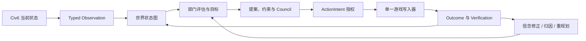

# Civ6 Belief Engine：图工程改造理解

## 一句话结论

这个项目要改造成的不是“使用图数据库的 Civ6 工具”，而是一个**以关系、证据和因果链为核心的智能体决策工程**：把分散的游戏状态、观察、信念、目标、决策、动作与结果组织成可追溯的图，并用一条确定、可验证的执行链驱动游戏。

图是解决问题的手段，不是目标。第一阶段不需要 Neo4j、LangGraph 或通用图框架；Python 数据结构、现有 JSONL 事件流和清晰的领域边界已经足够。

## 1. 从第一性原理重新定义问题

LLM 玩 Civ6 的核心困难不是“缺少更多工具”，而是以下四件事无法仅靠一段上下文稳定解决：

1. **世界是动态且部分可见的**：城市、单位、外交和资源每回合都在变化，战争迷雾意味着“没有看到”不等于“不存在”。
2. **事实、推断和计划容易混在一起**：工具结果是事实，信念是解释，计划是承诺，三者必须有不同的可信度和生命周期。
3. **一个动作依赖多条关系**：例如生产城墙，不只取决于城市能否生产，还取决于威胁、目标、资源锁、机会成本和治理授权。
4. **动作完成不等于目标达成**：每次执行都必须连接到前置证据、授权决策和后置验证，否则无法复盘或修正策略。

因此，图工程的根本目标是：

> 让智能体在每个回合都能回答“我知道什么、为什么相信、要实现什么、为什么这样行动、结果是否符合预期”。

## 2. 图工程在本项目中的准确含义

本项目只需要一张统一逻辑图，内部包含三个相互连接的子图。

| 子图 | 解决的问题 | 典型内容 |
|---|---|---|
| 世界状态图 | 当前观察到的世界是什么 | 玩家、城市、单位、地块、资源、外交关系 |
| 信念决策图 | 为什么形成某个判断与选择 | Observation、Belief、Goal、Proposal、Decision、Constraint |
| 执行验证图 | 一个决定如何安全落地并得到验证 | ActionIntent、Action、Outcome、Verification、Failure Attribution |

它们不应成为三套状态系统。世界状态提供事实，信念决策解释事实，执行验证检验解释，最终仍由同一个事件流记录变化。

## 3. 图中的最小语义

### 节点

- `WorldEntity`：玩家、城市、单位、地块、科技、资源等可稳定识别的游戏对象。
- `Observation`：某回合由某个工具直接获得的事实及来源指纹。
- `Belief`：基于 Observation 得出的可修正解释，包含概率、置信度和反证条件。
- `Goal`：希望达到的世界状态。
- `Proposal`：为 Goal 提出的候选方案。
- `Constraint`：规则、预算锁、前置证据或不可逆性限制。
- `Decision`：经过治理后被选择或拒绝的方案。
- `Action`：实际提交给游戏的写操作。
- `Outcome`：动作返回及后续状态变化。

### 边

- 世界关系：`OWNS`、`LOCATED_AT`、`AT_WAR_WITH`、`RESEARCHING`。
- 证据关系：`OBSERVES`、`SUPPORTS`、`CONTRADICTS`、`DERIVED_FROM`。
- 目标关系：`SERVES`、`DEPENDS_ON`、`BLOCKED_BY`、`RESERVES`。
- 执行关系：`SELECTS`、`AUTHORIZES`、`EXECUTES`、`PRODUCES`、`VERIFIES`。

节点和边都至少携带：稳定 ID、类型、回合、来源、状态和版本。只有推断类节点需要概率与置信度；观察事实不应伪装成概率判断。

## 4. 单一事实源

图工程最容易出现的错误，是建立第二套“看似更智能”的游戏状态。这里必须明确三层所有权：

1. **Civ6 实时状态**：当前游戏事实的最终权威，由 `GameState` 通过 FireTuner 查询。
2. **JSONL 事件流**：历史事实、决策和动作的审计权威，只追加，不原地改写历史。
3. **图快照与索引**：由事件和当前观察物化出的决策视图，可以重建，不是新的事实源。

DSH transcript 与 Telemetry 继续保存原始工具结果；图只保存规范化事实、引用指纹和实体关系，避免第三份原始数据副本。

## 5. 当前代码与目标职责的映射

| 当前实现 | 保留的价值 | 图工程中的目标职责 |
|---|---|---|
| `GameState` | 类型化游戏边界 | `GamePort` 的 Civ6 实现，仍是实时状态权威 |
| `snapshot_world_state()` | 已能生成实体、关系和指标 | 收敛为纯函数 `GraphProjector` |
| `BeliefEngine` | 事件追加、回放、墓碑语义 | 拆为 `GraphEventStore` 与 `GraphMaterializer` |
| 六个 Department | 独立策略评估 | 只读取 `GraphView`，输出候选目标与 workstream |
| Governance Council | 约束、预算锁、ActionIntent | 作为确定性决策节点，不直接执行游戏动作 |
| `_logged` | 公共授权、记录和错误边界 | 收敛为统一 Action Pipeline |
| `end_turn.py` | 回合安全与恢复经验 | 拆成可观测、可重试的执行步骤图 |
| `server.py` | 稳定 MCP 兼容面 | 只负责依赖装配和工具注册 |

兼容面保持不变：`civ_mcp`、`civ-mcp`、`mcp__civ6__*`、`APP:civ6-mcp` 和 `~/.civ6-mcp`。

## 6. 明确不图化的部分

根据奥卡姆剃刀，以下部分继续使用普通模块和函数：

- FireTuner TCP 协议、连接锁和重连。
- Lua builder、parser 与具体游戏 API 适配。
- 游戏启动、OCR、存档文件管理。
- Telemetry sink、Web API 和日志输出。
- 简单、无依赖、无治理要求的读取工具。

这些部分的复杂性来自协议或平台，不来自关系推理。强行图化只会增加节点数量和调试成本。

## 7. 最小改造路径

### 阶段一：固定边界

- 固定现有 MCP 工具名、参数、Runtime Policy 和旧导入路径。
- 修复默认 pytest 入口，建立可重复的离线基线。
- 将领域 DTO 从 `civ_mcp.lua.models` 移到产品领域包，倒置依赖方向。

### 阶段二：建立最小图核心

- 定义不可变的 `Node`、`Edge`、`GraphSnapshot`、`GraphDelta`。
- 将现有 typed snapshot 通过纯函数投影为图。
- 增加节点、边、邻接和按类型查询的内存索引。
- 校验稳定 ID、无悬空边、同回合一致性和确定性哈希。

### 阶段三：事件增量化

- 新事件只记录节点/边的新增、更新、归档和失效。
- 历史 JSONL 通过兼容读取器继续回放，不原地迁移。
- 为边增加有效回合和来源，使城市易主、单位死亡等变化可表达。

### 阶段四：执行图化

- 将 Department workstream、依赖、Council、ActionIntent、Action、Verification 连接成确定性 DAG。
- 只有带完成证据的依赖才能解除。
- 保持单写入器、参数哈希绑定、预算锁和 fail-closed 行为。
- 最后再拆小 `server.py` 与 `end_turn.py`，而不是先做文件搬家。

## 8. 必须守住的不变量

- 事实、推断、计划和结果不能混为一种节点。
- 图的任何结论都必须能追溯到 Observation 或明确规则。
- 图快照必须可以从事件流重建。
- 同一份输入必须产生相同的图 ID、投影和决策顺序。
- 一个真实游戏只能有一个 FireTuner 客户端和一个动作写入器。
- 高影响动作必须保留 Council 与 ActionIntent 授权。
- 离线测试、DSH 组合检查和真实游戏验收必须分别报告。

## 9. 主要盲点与预防

- **战争迷雾**：节点未被本回合观察到，不等于节点已不存在；需要 `last_observed_turn` 和过期策略。
- **时间关系**：外交、占领和位置边必须有有效期，不能只覆盖最新值。
- **图膨胀**：不是每条日志都成为节点；只有会参与查询、决策或审计的对象进入图。
- **断线后的不确定结果**：Action 必须允许 `executing -> verified/retryable`，不能因客户端超时重复执行。
- **策略伪精确**：概率与置信度是不同概念，不能合成一个“综合评分”替代约束判断。
- **框架绑架设计**：先证明查询和执行需求，再决定是否需要外部图数据库或图运行框架。

## 10. 完成标准

图工程第一版完成，不以“目录中出现 graph 文件夹”为准，而以以下能力为准：

1. 任一关键动作都能追溯到事实、目标、约束、决策和结果。
2. 任一回合都能重建当时的世界图与决策图。
3. Department 可以通过稳定图查询工作，不再依赖 MCP/Lua 类型。
4. workstream 依赖能够按证据推进，而不是只生成文字计划。
5. 旧 MCP 客户端、DSH 配置和历史 JSONL 仍可使用。
6. 现有离线测试全部通过，并完成一次真实读取、治理动作和回合推进验收。

## 最终判断

这个项目的图工程本质上是把已有的“状态采集 + Belief + Governance + ActionIntent”从多个局部机制，收敛为一个**可追溯的关系模型和可验证的行动闭环**。

最小正确路线是：**先统一语义和依赖方向，再建立图模型；先用现有 JSONL 和内存索引跑通，再考虑外部图基础设施。**

---

# 对抗式审查（2026-08-14，基于实际代码逐条核验）

审查方法：将本计划中每一条对现状的断言与代码对照，读穿了 `belief_engine.py`、`governance/snapshot.py`、`governance/council.py`、`governance/models.py`、`governance/departments/base.py`、`server.py` 动作管道与 `end_turn.py` 主流程；随后用**事后验尸**（假设图工程第一版已经失败，倒推死因）和**逆向思考**（不问"图怎么建"，问"什么会先于图把系统弄坏"）两个模型组织发现。文中行号以审查当日代码为准。

离线基线实测：`uv run pytest tests/ -q` 排除收集即失败的 `tests/test_scorer.py` 后 **270 passed**；`test_scorer.py` 因根目录 `evals` 包不可导入而 ModuleNotFoundError——计划阶段一"修复默认 pytest 入口"的断言当场成立，且比计划描述的更具体：不是入口参数问题，而是 src 布局下根目录包无 sys.path 注入、无 conftest.py。

## A. 事实核验：计划与代码的符合度

| 计划断言 | 核验结果 |
|---|---|
| `snapshot_world_state()` 已生成实体、关系、指标 | ✅ `src/civ6_belief_engine/governance/snapshot.py:275`，纯函数、确定性排序、canonical 哈希 |
| BeliefEngine 事件追加、回放、墓碑语义 | ✅ append-only JSONL（`~/.civ6-mcp/beliefs/`）、`_load`/`_reduce` 重放、`deleted`/`archived` 双墓碑 |
| 六个 Department 独立评估 | ✅ `departments/base.py:13` 六枚举 + coordinator；但注意：读的是 `TurnSnapshot`（typed dataclass），不是图视图——计划自己也说这是"目标职责"，映射成立 |
| Council 是确定性决策节点，不执行动作 | ✅ 硬约束 fail-closed → 锁 → 优先级字典序 → Pareto → 机会成本，无加权综合分 |
| `_logged` 公共授权、记录、错误边界 | ✅ `src/civ_mcp/server.py:874` |
| 兼容面五标识 `civ_mcp` / `civ-mcp` / `mcp__civ6__*` / `APP:civ6-mcp` / `~/.civ6-mcp` | ✅ 前四个与第五个均验证（shim 转发、`pyproject.toml:75` 入口、DSH 命名约定、握手机制、belief 目录）；`APP:` 标识字符串本身来自游戏侧响应，离线无法复验其字面值 |
| DTO 在 `civ_mcp.lua.models`、依赖方向待倒置 | ✅ 仍在：`governance/snapshot.py:19` 与 `governance/models.py:19` 都反向 import MCP 适配层 |
| `server.py`（5532 行）、`end_turn.py`（1711 行）需要最后拆 | ✅ 体量确认，拆分排序判断合理 |

结论：**计划对现状的描述诚实、无粉饰**，这是它最值得肯定的地方。以下问题全部出在计划"没写"的部分，而不是"写错"的部分。

### 计划未覆盖的现状事实（后文引用）

1. BeliefEngine 还是一个**决策状态机**（`authorized → executing → succeeded/retryable/cancelled`，`belief_engine.py:1012`、`:1031`），外加 `governance_turn_gate` 回合门禁。计划第 5 节把它拆为 `GraphEventStore` 与 `GraphMaterializer`，**这两块只覆盖事件与物化，授权/状态机/门禁没有归属**——恰恰是阶段四"执行图化"最难迁移的部分。
2. `Workstream.exit_conditions` 与 `dependencies` 是**自由文本字符串元组**（`departments/base.py:78`），而 belief 侧 `evaluate_condition` 是结构化 metric 规则。两套"条件"表达并存，无人翻译。完成标准 #4"依赖按证据推进"卡在这座未定义的桥上。
3. `DepartmentContext.agenda` 只是 goal 的 `statement` 字符串列表（`server.py:3720-3729`）。目标与部门评估之间今天是文本耦合；`GraphView` 若不提供等价物，部门要么继续读 `TurnSnapshot`，要么失去议程。
4. `normalize_tool_result()` 仍用**正则从叙述文本提取 facts/metrics**（`belief_engine.py:79`），与 typed snapshot 双轨进入 `current_metrics`，且键空间不同（`gold` vs `player.gold`）。计划说"图只存规范化事实"，但没给这条正则路径安排退役时序——不退役，它就是计划第 4 节自己警告的"第三份事实源"。

## B. 事后验尸：假设 12 个月后图工程第一版失败了，验尸报告会写什么

### 死因 P0-1：`executing` 决策孤儿导致整局死锁（今天已存在，图化会放大暴露面）

死亡链：`authorize_action` 在 `fn()` 执行**前**把 decision 置为 `executing`（`belief_engine.py:1012-1023`）→ `_logged` 只捕获 `(LuaError, ValueError)` 和 `ConnectionError`（`server.py:939`、`:963`），解析器抛出 KeyError/IndexError/RuntimeError、进程被杀、或 MCP 客户端取消长 end_turn（`asyncio.CancelledError`）时**没有任何路径落 outcome** → 更隐蔽的是 `_record_belief_tool_result` 自身整体 try/except Exception 吞错（`server.py:870-871`）：若记录时 engine 未绑定需再查游戏身份而连接已死，即使走了被捕获的异常路径也不会记录 → decision 永久停在 `executing`，而 `cancel_action_authorization` 明确拒绝取消 executing（`belief_engine.py:1092-1093`），`governance_turn_gate` 因此永久阻塞 `end_turn`（`belief_engine.py:1906-1914`）→ 唯一出路是手改 JSONL。

这不是图化后才有的 bug，但阶段四把**更多动作**纳入 ActionIntent 体系后，暴露面从"少数高影响动作"扩大到"全部受治理动作"。**修复必须前置于任何图工作**：给 executing 加回合超时→retryable，或加载时回收孤儿 executing。

### 死因 P0-2：连接层重发写命令 = 双重执行；超时 = 静默部分数据

- `connection.py:147-151`：死套接字时重连后**重发同一条命令**——对游戏写动作同样适用。FireTuner 命令可能已被游戏执行、只是输出丢失；重发即双执行（金币扣两次、单位动两步）。
- `connection.py:170-179`：等待输出超时后 `break`，**静默返回已收集的部分行，不抛错**。解析器拿到空/半截输入，轻则报错（被当 failure），重则解析出默认值进入 observation。

计划第 9 节点名了这个问题，但它被放在"盲点"里，而**没有进入阶段一的修复清单**。参数哈希绑定（`ActionIntent.arguments_hash`）防的是"错参数执行"，防不了"同一 intent 被物理执行两次"。正确做法：写命令禁止自动重发（或重发前先幂等性验证读），超时必须显式抛出而非返回部分行。这是阶段四 Verification 节点能站住的前提。

### 死因 P0-3：JSONL 尾部损坏后静默吞掉所有后续事件——审计权威在唯一需要它的场景下最脆弱

`_append` 直接 `open("a")` 追加无原子性保障；崩溃截断最后一行后，下一次 append 的新 JSON 会**拼接到同一坏行**上；`_load` 对无法解析的行 `continue` 静默跳过（`belief_engine.py:461-467`）→ 重启后从坏行起**所有事件消失且零告警**，而运行中进程的内存态与之分叉。计划第 4 节宣布"JSONL 是审计权威"、不变量要求"图快照可从事件流重建"——但当前实现在崩溃恢复这个唯一真正需要审计权威的场景里会无声地背叛它。最低修复：每事件自带长度哨兵或行尾校验、重载时坏行隔离并显式报告、`_sequence` 与行数对账。

### 死因 P0-4：autosave 回滚后事件流与游戏状态分叉，"任一回合可重建"语义失效

`_logged` 内 5 次连续连接失败会自动 `restart_and_load` 存档（`server.py:987-1019`）——游戏被拉回更早回合，但 append-only 事件流没有 epoch/branch 标记 → 同一回合号在日志里出现两套先后矛盾的事实。`end_turn.py:533` 的 save-scumming 检测证明"游戏回退"是真实高频场景，不是假想。完成标准 #2（任一回合重建当时世界图）在回滚后未定义：重建到回滚前还是回滚后？计划需要引入**游戏纪元（epoch/reload marker）事件**并规定回放语义。

### 死因 P1：图还没膨胀，事件先膨胀了

`ingest_typed_snapshot` 每回合对**每个** world_entity 全量 update（payload 含 `observed_turn` 恒变 → `update()` 判定有变化 → 每实体每回合一条**全量实体快照**事件，links 还双向冗余存两份，`belief_engine.py:1214-1251`）；`_events` 全量驻内存不淘汰；`review()` 在每次查询后执行、`_evidence_requirements_satisfied` 每次授权全事件线性扫描（`belief_engine.py:859-864`）。神级长局数百回合后，JSONL 以数十 MB 计、每回合成本线性上涨。阶段三"事件增量化"方向正确，但**计划没有基线数字**：改造前应实测现有 `belief_*.jsonl` 的每回合事件数/字节数，否则新索引无法证明是改进。

### 死因 P2-1：城市实体 ID 内嵌归属者，"城市易主可表达"在 ID 方案层面就已断裂

`city:{player_id}:{city_id}`（`snapshot.py:348`）——城市被占领 → ID 变 → 实体身份断裂，历史追溯断链，边的有效期（阶段三）救不了节点换名。阶段二定义"稳定 ID"规范时必须先裁决：城市 ID 只用游戏内 city_id，归属改为 `owns` 边的属性。

### 死因 P2-2：end_turn 的隐藏时序契约被 DAG 化摧毁

`end_turn.py:600-625` 附近：World Congress handler 必须在 `ACTION_ENDTURN` **之前同步注册**，因为 WC 会话在 end-turn 动作内部开合；popup 预先 dismiss；宣战回合战斗引擎下一回合才同步。这些是步骤间的**时序副作用**，不是数据依赖。阶段四若把执行步骤建模为"按证据解锁的独立节点"，任何重排/并行化尝试都会破坏这些契约，且离线测试很难覆盖。计划需要新增不变量：**时序敏感边必须显式声明且禁止并行**，并把 end_turn 现有序列逐条标注。

## C. 逆向思考：倒过来问

1. **谁消费图？** 阶段二要建 `GraphSnapshot/GraphDelta/邻接索引`，但计划没有列出一个真实查询消费者——哪个 Department 的哪个决策需要哪个邻接/时序查询？计划第 9 节反对框架绑架，却没把"消费者查询清单"写成阶段二的入口条件。没有消费者先行，`GraphDelta` 就是无人调用的 API，两年后变成第二个 `spatial.py`。建议：先写出军事部"哪些敌军单位在我城市两格内"和外交部"某 AI 的关系边最近 N 回合如何变化"这两三个真实查询，再定索引结构。
2. **TurnSnapshot 与 GraphView 双轨，谁是权威？** 如果阶段四做完，Departments 因 `agenda`/`goals` 等价物缺失而继续读 `TurnSnapshot`，图就沦为第二套状态——计划第 4 节最反对的错误由计划自己制造。需要一致性测试（同一 typed snapshot 的投影回答与 GraphView 回答等价）或明确的切换时点与淘汰条件。
3. **阶段一"固定边界"缺自动护栏。** 现有的 `tests/test_product_package_boundary.py` 只验证 7 行 import 恒等；没有任何 MCP 工具名/参数 schema 的快照测试。阶段一说"固定工具名、参数"，但没有 golden test，一次顺手改参数名就会静默破坏 `mcp__civ6__*` 兼容面。工具签名快照测试应列入阶段一。
4. **计划与代码的一处价值冲突需要裁决。** 第 9 节说"概率与置信度不能合成综合评分替代约束判断"，但 `route_decision` 正是 0.35/0.25/0.15/0.2/0.05/0.1 的加权和决定路由（`belief_engine.py:2004-2025`），且 `belief_review_required` 时强制抬到 0.75。Council 侧是 Pareto（合规），belief 路由侧是加权分（计划未提及）。图化时若沉默照搬，等于把计划反对的东西制度化。裁决建议：保留（评分只选 route/预算档，不选方案，与 Council 的 Pareto 不冲突）并写进计划，明确"评分不得出现在任何方案选择路径上"。
5. **单写入者是纪律不是机制。** `GameConnection` 的 `asyncio.Lock` 只防单进程并发；无跨进程锁、无启动独占探测。不变量"一个真实游戏只有一个客户端和一个写入器"应指明强制手段（至少：握手成功后探测已有连接/写入 PID 文件）。
6. **完成标准 #6 的验收剧本缺失。** "一次真实读取、治理动作和回合推进验收"——谁跑、按什么剧本、什么算过，计划没写。`docs/agent-startup.md` 有启动验收但没有治理动作验收剧本；建议在阶段四前补一份，作为完成标准 #6 的判据。

## D. 修订建议（按优先级排序，替代原阶段排序的前置项）

**新增阶段零（在一切图工作之前，全部在现有架构内可修，不动接口）：**
1. `executing` 孤儿回收：回合结束或重载时超时→retryable，允许显式取消（对应 P0-1）。
2. 连接层：写命令禁自动重发；超时显式抛错不返回部分行（对应 P0-2）。
3. JSONL 完整性：行校验、坏行隔离报告、重载对账（对应 P0-3）。
4. reload/epoch 标记事件，规定回滚后的回放语义（对应 P0-4）。
5. 上述四项各配离线回归测试；这是"离线测试全绿"与"真实可用"之间当前最大的缺口。

**阶段一追加：** MCP 工具签名 golden test；pytest 修复需覆盖 `test_scorer.py`（conftest 注入根目录）。

**阶段二入口条件：** 消费者查询清单先行；裁决城市等实体 ID 规范（不含 owner）；把 BeliefEngine 决策状态机的去处写进第 5 节映射表。

**阶段三前置：** 实测事件流基线（每回合事件数/字节数），作为增量化改进的对照数字。

**阶段四前置：** end_turn 时序契约标注为不可并行不变量；统一 `exit_conditions` 从自由文本到结构化规则的桥。

## 验尸官结论

计划的方向判断全部正确：不引外部图库、事件溯源、单写入器、分层所有权、兼容面枚举，这些决定经代码核验后站得住。但四个 P0 是地基裂缝——任何一条在真实长局爆发，验尸报告都会写"图模型很漂亮，游戏卡死在 executing，或账本与游戏状态对不上"。**这个项目的图工程成败不取决于图模型设计，而取决于执行与审计底座的可靠性**：授权状态机、传输重试语义、日志完整性、回滚标记。因此最关键的一处修订是：把上述 P0 从"盲点与预防"升级为"阶段零"，并且完成标准 #6 的真实游戏验收必须包含一次崩溃/断线恢复演练——离线 270 绿不等于集成可用，这个原则项目自己的 CLAUDE.md 已经写过，计划应当引用它而不是重新发明。

## 阶段零修复记录（2026-08-14，已实施）

四个 P0 已按上节修订建议修复并全部通过离线回归测试（270 → 296+，新增 `tests/test_belief_engine_p0.py` 14 项与 `tests/test_connection_reliability.py` 8 项；两个直接编码旧死锁行为的存量测试按新契约重写）：

- **P0-1**：`_logged` 新增通用异常处理器（`asyncio.CancelledError` 除外）确保失败必落账；executing 孤儿三层回收——进程重启加载时（`recovery_reason=process_restarted_during_execution`）、governance turn gate 跨回合回收（`stale_executing_reclaimed_turn_boundary`）、`cancel_action_authorization` 允许取消跨回合陈旧 executing。
- **P0-2**：新增 `GameConnection.execute_mutation` 通道（game_state.py 63 处、end_turn.py 14 处、game_lifecycle.py 6 处迁移——含 popup Close、save_game、load_save/load_game_save，后者经 `execute_in_state(mutation=True)` 支持 state 局部变异；各点原 timeout 保留），变异命令恰好发送一次、死套接字抛 `MutationOutcomeUnknownError`；超时未收到 sentinel 抛 `CommandTimeoutError`（两者分别继承 LuaError/ConnectionError，被 `_logged` 现有处理器正确记录）；`run_lua` 与状态探测通道保持宽松。全部变异 Lua 片段已逐一核实带 sentinel 收尾。
- **P0-3**：`_append` flush+fsync；`_load` 坏行隔离（json 失败与非 dict 行）、原子重写为纯完好行、追加 `log.integrity` 标记（行号+sha256+预览），毒行拼接问题消除；读取用 `errors="replace"` 防止 UTF-8 截断炸掉整个加载。
- **P0-4**：事件携带 `epoch` 字段；`record_game_reload` 落 `game.reloaded` 标记、作废旧 epoch 未决授权（`invalidated_by_game_reload`）并归档关联预算锁；`ingest_typed_snapshot` 自动检测回合回退并开新 epoch；server.py 连接自动恢复路径在 `restart_and_load` 后显式记录标记。

失败语义与 agent 处置已写入 [docs/agent-recovery.md](../docs/agent-recovery.md)「传输与审计底座的失败语义」。**未完成项**：完成标准 #6 要求的真实游戏验收（含一次崩溃/断线恢复演练）仍待执行——离线全绿不能替代该项，图阶段开工前必须补上。另注：`CommandTimeoutError` 对存量查询通道默认开启严格 sentinel，首次真实游戏会话应留意是否有旧查询路径误报超时。
