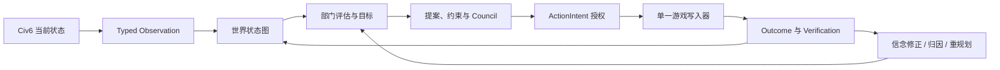
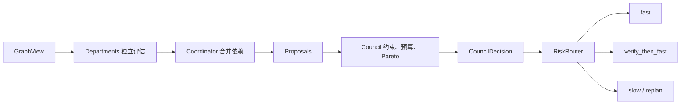
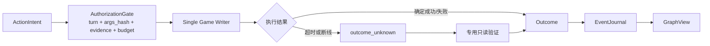

# Civ6 Belief Engine：图工程改造理解

## 一句话结论

这个项目要改造成的不是“使用图数据库的 Civ6 工具”，而是一个**以关系、证据和因果链为核心的智能体决策工程**：把分散的游戏状态、观察、信念、目标、决策、动作与结果组织成可追溯的图，并用一条确定、可验证的执行链驱动游戏。

图是解决问题的手段，不是目标。第一阶段不需要 Neo4j、LangGraph 或通用图框架；Python 数据结构、现有 JSONL 事件流和清晰的领域边界已经足够。

## 1. 从第一性原理重新定义问题

LLM 玩 Civ6 的核心困难不是“缺少更多工具”，而是以下四件事无法仅靠一段上下文稳定解决：

1. **世界是动态且部分可见的**：城市、单位、外交和资源每回合都在变化，战争迷雾意味着“没有看到”不等于“不存在”。
2. **事实、推断和计划容易混在一起**：工具结果是事实，信念是解释，计划是承诺，三者必须有不同的可信度和生命周期。
3. **一个动作依赖多条关系**：例如生产城墙，不只取决于城市能否生产，还取决于威胁、目标、资源锁、机会成本和治理授权。
4. **动作完成不等于目标达成**：每次执行都必须连接到前置证据、授权决策和后置验证，否则无法复盘或修正策略。

因此，图工程的根本目标是：

> 让智能体在每个回合都能回答“我知道什么、为什么相信、要实现什么、为什么这样行动、结果是否符合预期”。

## 2. 图工程在本项目中的准确含义

本项目只需要一张统一逻辑图，内部包含三个相互连接的子图。

| 子图 | 解决的问题 | 典型内容 |
|---|---|---|
| 世界状态图 | 当前观察到的世界是什么 | 玩家、城市、单位、地块、资源、外交关系 |
| 信念决策图 | 为什么形成某个判断与选择 | Observation、Belief、Goal、Proposal、Decision、Constraint |
| 执行验证图 | 一个决定如何安全落地并得到验证 | ActionIntent、Action、Outcome、Verification、Failure Attribution |

它们不应成为三套状态系统。世界状态提供事实，信念决策解释事实，执行验证检验解释，最终仍由同一个事件流记录变化。



## 3. 图中的最小语义

### 节点

- `WorldEntity`：玩家、城市、单位、地块、科技、资源等可稳定识别的游戏对象。
- `Observation`：某回合由某个工具直接获得的事实及来源指纹。
- `Belief`：基于 Observation 得出的可修正解释，包含概率、置信度和反证条件。
- `Goal`：希望达到的世界状态。
- `Proposal`：为 Goal 提出的候选方案。
- `Constraint`：规则、预算锁、前置证据或不可逆性限制。
- `Decision`：经过治理后被选择或拒绝的方案。
- `Action`：实际提交给游戏的写操作。
- `Outcome`：动作返回及后续状态变化。

### 边

- 世界关系：`OWNS`、`LOCATED_AT`、`AT_WAR_WITH`、`RESEARCHING`。
- 证据关系：`OBSERVES`、`SUPPORTS`、`CONTRADICTS`、`DERIVED_FROM`。
- 目标关系：`SERVES`、`DEPENDS_ON`、`BLOCKED_BY`、`RESERVES`。
- 执行关系：`SELECTS`、`AUTHORIZES`、`EXECUTES`、`PRODUCES`、`VERIFIES`。

节点和边都至少携带：稳定 ID、类型、回合、来源、状态和版本。只有推断类节点需要概率与置信度；观察事实不应伪装成概率判断。

## 4. 单一事实源

图工程最容易出现的错误，是建立第二套“看似更智能”的游戏状态。这里必须明确三层所有权：

1. **Civ6 实时状态**：当前游戏事实的最终权威，由 `GameState` 通过 FireTuner 查询。
2. **JSONL 事件流**：历史事实、决策和动作的审计权威，只追加，不原地改写历史。
3. **图快照与索引**：由事件和当前观察物化出的决策视图，可以重建，不是新的事实源。

DSH transcript 与 Telemetry 继续保存原始工具结果；图只保存规范化事实、引用指纹和实体关系，避免第三份原始数据副本。

## 5. 当前代码与目标职责的映射

| 当前实现 | 保留的价值 | 图工程中的目标职责 |
|---|---|---|
| `GameState` | 类型化游戏边界 | `GamePort` 的 Civ6 实现，仍是实时状态权威 |
| `snapshot_world_state()` | 已能生成实体、关系和指标 | 收敛为纯函数 `GraphProjector` |
| `BeliefEngine` | 事件追加、回放、墓碑语义 | 拆为 `GraphEventStore` 与 `GraphMaterializer` |
| 六个 Department | 独立策略评估 | 只读取 `GraphView`，输出候选目标与 workstream |
| Governance Council | 约束、预算锁、ActionIntent | 作为确定性决策节点，不直接执行游戏动作 |
| `_logged` | 公共授权、记录和错误边界 | 收敛为统一 Action Pipeline |
| `end_turn.py` | 回合安全与恢复经验 | 拆成可观测、可重试的执行步骤图 |
| `server.py` | 稳定 MCP 兼容面 | 只负责依赖装配和工具注册 |

兼容面保持不变：`civ_mcp`、`civ-mcp`、`mcp__civ6__*`、`APP:civ6-mcp` 和 `~/.civ6-mcp`。

## 6. 明确不图化的部分

根据奥卡姆剃刀，以下部分继续使用普通模块和函数：

- FireTuner TCP 协议、连接锁和重连。
- Lua builder、parser 与具体游戏 API 适配。
- 游戏启动、OCR、存档文件管理。
- Telemetry sink、Web API 和日志输出。
- 简单、无依赖、无治理要求的读取工具。

这些部分的复杂性来自协议或平台，不来自关系推理。强行图化只会增加节点数量和调试成本。

## 7. 最小改造路径

### 阶段一：固定边界

- 固定现有 MCP 工具名、参数、Runtime Policy 和旧导入路径。
- 修复默认 pytest 入口，建立可重复的离线基线。
- 将领域 DTO 从 `civ_mcp.lua.models` 移到产品领域包，倒置依赖方向。

### 阶段二：建立最小图核心

- 定义不可变的 `Node`、`Edge`、`GraphSnapshot`、`GraphDelta`。
- 将现有 typed snapshot 通过纯函数投影为图。
- 增加节点、边、邻接和按类型查询的内存索引。
- 校验稳定 ID、无悬空边、同回合一致性和确定性哈希。

### 阶段三：事件增量化

- 新事件只记录节点/边的新增、更新、归档和失效。
- 历史 JSONL 通过兼容读取器继续回放，不原地迁移。
- 为边增加有效回合和来源，使城市易主、单位死亡等变化可表达。

### 阶段四：执行图化

- 将 Department workstream、依赖、Council、ActionIntent、Action、Verification 连接成确定性 DAG。
- 只有带完成证据的依赖才能解除。
- 保持单写入器、参数哈希绑定、预算锁和 fail-closed 行为。
- 最后再拆小 `server.py` 与 `end_turn.py`，而不是先做文件搬家。

## 8. 必须守住的不变量

- 事实、推断、计划和结果不能混为一种节点。
- 图的任何结论都必须能追溯到 Observation 或明确规则。
- 图快照必须可以从事件流重建。
- 同一份输入必须产生相同的图 ID、投影和决策顺序。
- 一个真实游戏只能有一个 FireTuner 客户端和一个动作写入器。
- 高影响动作必须保留 Council 与 ActionIntent 授权。
- 离线测试、DSH 组合检查和真实游戏验收必须分别报告。

## 9. 主要盲点与预防

- **战争迷雾**：节点未被本回合观察到，不等于节点已不存在；需要 `last_observed_turn` 和过期策略。
- **时间关系**：外交、占领和位置边必须有有效期，不能只覆盖最新值。
- **图膨胀**：不是每条日志都成为节点；只有会参与查询、决策或审计的对象进入图。
- **断线后的不确定结果**：Action 必须允许 `executing -> verified/retryable`，不能因客户端超时重复执行。
- **策略伪精确**：概率与置信度是不同概念，不能合成一个“综合评分”替代约束判断。
- **框架绑架设计**：先证明查询和执行需求，再决定是否需要外部图数据库或图运行框架。

## 10. 完成标准

图工程第一版完成，不以“目录中出现 graph 文件夹”为准，而以以下能力为准：

1. 任一关键动作都能追溯到事实、目标、约束、决策和结果。
2. 任一回合都能重建当时的世界图与决策图。
3. Department 可以通过稳定图查询工作，不再依赖 MCP/Lua 类型。
4. workstream 依赖能够按证据推进，而不是只生成文字计划。
5. 旧 MCP 客户端、DSH 配置和历史 JSONL 仍可使用。
6. 现有离线测试全部通过，并完成一次真实读取、治理动作和回合推进验收。

## 最终判断

这个项目的图工程本质上是把已有的“状态采集 + Belief + Governance + ActionIntent”从多个局部机制，收敛为一个**可追溯的关系模型和可验证的行动闭环**。

最小正确路线是：**先统一语义和依赖方向，再建立图模型；先用现有 JSONL 和内存索引跑通，再考虑外部图基础设施。**

---

# 对抗式审查（2026-08-14，基于实际代码逐条核验）

审查方法：将本计划中每一条对现状的断言与代码对照，读穿了 `belief_engine.py`、`governance/snapshot.py`、`governance/council.py`、`governance/models.py`、`governance/departments/base.py`、`server.py` 动作管道与 `end_turn.py` 主流程；随后用**事后验尸**（假设图工程第一版已经失败，倒推死因）和**逆向思考**（不问"图怎么建"，问"什么会先于图把系统弄坏"）两个模型组织发现。文中行号以审查当日代码为准。

离线基线实测：`uv run pytest tests/ -q` 排除收集即失败的 `tests/test_scorer.py` 后 **270 passed**；`test_scorer.py` 因根目录 `evals` 包不可导入而 ModuleNotFoundError——计划阶段一"修复默认 pytest 入口"的断言当场成立，且比计划描述的更具体：不是入口参数问题，而是 src 布局下根目录包无 sys.path 注入、无 conftest.py。

## A. 事实核验：计划与代码的符合度

| 计划断言 | 核验结果 |
|---|---|
| `snapshot_world_state()` 已生成实体、关系、指标 | ✅ `src/civ6_belief_engine/governance/snapshot.py:275`，纯函数、确定性排序、canonical 哈希 |
| BeliefEngine 事件追加、回放、墓碑语义 | ✅ append-only JSONL（`~/.civ6-mcp/beliefs/`）、`_load`/`_reduce` 重放、`deleted`/`archived` 双墓碑 |
| 六个 Department 独立评估 | ✅ `departments/base.py:13` 六枚举 + coordinator；但注意：读的是 `TurnSnapshot`（typed dataclass），不是图视图——计划自己也说这是"目标职责"，映射成立 |
| Council 是确定性决策节点，不执行动作 | ✅ 硬约束 fail-closed → 锁 → 优先级字典序 → Pareto → 机会成本，无加权综合分 |
| `_logged` 公共授权、记录、错误边界 | ✅ `src/civ_mcp/server.py:874` |
| 兼容面五标识 `civ_mcp` / `civ-mcp` / `mcp__civ6__*` / `APP:civ6-mcp` / `~/.civ6-mcp` | ✅ 前四个与第五个均验证（shim 转发、`pyproject.toml:75` 入口、DSH 命名约定、握手机制、belief 目录）；`APP:` 标识字符串本身来自游戏侧响应，离线无法复验其字面值 |
| DTO 在 `civ_mcp.lua.models`、依赖方向待倒置 | ✅ 仍在：`governance/snapshot.py:19` 与 `governance/models.py:19` 都反向 import MCP 适配层 |
| `server.py`（5532 行）、`end_turn.py`（1711 行）需要最后拆 | ✅ 体量确认，拆分排序判断合理 |

结论：**计划对现状的描述诚实、无粉饰**，这是它最值得肯定的地方。以下问题全部出在计划"没写"的部分，而不是"写错"的部分。

### 计划未覆盖的现状事实（后文引用）

1. BeliefEngine 还是一个**决策状态机**（`authorized → executing → succeeded/retryable/cancelled`，`belief_engine.py:1012`、`:1031`），外加 `governance_turn_gate` 回合门禁。计划第 5 节把它拆为 `GraphEventStore` 与 `GraphMaterializer`，**这两块只覆盖事件与物化，授权/状态机/门禁没有归属**——恰恰是阶段四"执行图化"最难迁移的部分。
2. `Workstream.exit_conditions` 与 `dependencies` 是**自由文本字符串元组**（`departments/base.py:78`），而 belief 侧 `evaluate_condition` 是结构化 metric 规则。两套"条件"表达并存，无人翻译。完成标准 #4"依赖按证据推进"卡在这座未定义的桥上。
3. `DepartmentContext.agenda` 只是 goal 的 `statement` 字符串列表（`server.py:3720-3729`）。目标与部门评估之间今天是文本耦合；`GraphView` 若不提供等价物，部门要么继续读 `TurnSnapshot`，要么失去议程。
4. `normalize_tool_result()` 仍用**正则从叙述文本提取 facts/metrics**（`belief_engine.py:79`），与 typed snapshot 双轨进入 `current_metrics`，且键空间不同（`gold` vs `player.gold`）。计划说"图只存规范化事实"，但没给这条正则路径安排退役时序——不退役，它就是计划第 4 节自己警告的"第三份事实源"。

## B. 事后验尸：假设 12 个月后图工程第一版失败了，验尸报告会写什么

### 死因 P0-1：`executing` 决策孤儿导致整局死锁（今天已存在，图化会放大暴露面）

死亡链：`authorize_action` 在 `fn()` 执行**前**把 decision 置为 `executing`（`belief_engine.py:1012-1023`）→ `_logged` 只捕获 `(LuaError, ValueError)` 和 `ConnectionError`（`server.py:939`、`:963`），解析器抛出 KeyError/IndexError/RuntimeError、进程被杀、或 MCP 客户端取消长 end_turn（`asyncio.CancelledError`）时**没有任何路径落 outcome** → 更隐蔽的是 `_record_belief_tool_result` 自身整体 try/except Exception 吞错（`server.py:870-871`）：若记录时 engine 未绑定需再查游戏身份而连接已死，即使走了被捕获的异常路径也不会记录 → decision 永久停在 `executing`，而 `cancel_action_authorization` 明确拒绝取消 executing（`belief_engine.py:1092-1093`），`governance_turn_gate` 因此永久阻塞 `end_turn`（`belief_engine.py:1906-1914`）→ 唯一出路是手改 JSONL。

这不是图化后才有的 bug，但阶段四把**更多动作**纳入 ActionIntent 体系后，暴露面从"少数高影响动作"扩大到"全部受治理动作"。**修复必须前置于任何图工作**：给 executing 加回合超时→retryable，或加载时回收孤儿 executing。

### 死因 P0-2：连接层重发写命令 = 双重执行；超时 = 静默部分数据

- `connection.py:147-151`：死套接字时重连后**重发同一条命令**——对游戏写动作同样适用。FireTuner 命令可能已被游戏执行、只是输出丢失；重发即双执行（金币扣两次、单位动两步）。
- `connection.py:170-179`：等待输出超时后 `break`，**静默返回已收集的部分行，不抛错**。解析器拿到空/半截输入，轻则报错（被当 failure），重则解析出默认值进入 observation。

计划第 9 节点名了这个问题，但它被放在"盲点"里，而**没有进入阶段一的修复清单**。参数哈希绑定（`ActionIntent.arguments_hash`）防的是"错参数执行"，防不了"同一 intent 被物理执行两次"。正确做法：写命令禁止自动重发（或重发前先幂等性验证读），超时必须显式抛出而非返回部分行。这是阶段四 Verification 节点能站住的前提。

### 死因 P0-3：JSONL 尾部损坏后静默吞掉所有后续事件——审计权威在唯一需要它的场景下最脆弱

`_append` 直接 `open("a")` 追加无原子性保障；崩溃截断最后一行后，下一次 append 的新 JSON 会**拼接到同一坏行**上；`_load` 对无法解析的行 `continue` 静默跳过（`belief_engine.py:461-467`）→ 重启后从坏行起**所有事件消失且零告警**，而运行中进程的内存态与之分叉。计划第 4 节宣布"JSONL 是审计权威"、不变量要求"图快照可从事件流重建"——但当前实现在崩溃恢复这个唯一真正需要审计权威的场景里会无声地背叛它。最低修复：每事件自带长度哨兵或行尾校验、重载时坏行隔离并显式报告、`_sequence` 与行数对账。

### 死因 P0-4：autosave 回滚后事件流与游戏状态分叉，"任一回合可重建"语义失效

`_logged` 内 5 次连续连接失败会自动 `restart_and_load` 存档（`server.py:987-1019`）——游戏被拉回更早回合，但 append-only 事件流没有 epoch/branch 标记 → 同一回合号在日志里出现两套先后矛盾的事实。`end_turn.py:533` 的 save-scumming 检测证明"游戏回退"是真实高频场景，不是假想。完成标准 #2（任一回合重建当时世界图）在回滚后未定义：重建到回滚前还是回滚后？计划需要引入**游戏纪元（epoch/reload marker）事件**并规定回放语义。

### 死因 P1：图还没膨胀，事件先膨胀了

`ingest_typed_snapshot` 每回合对**每个** world_entity 全量 update（payload 含 `observed_turn` 恒变 → `update()` 判定有变化 → 每实体每回合一条**全量实体快照**事件，links 还双向冗余存两份，`belief_engine.py:1214-1251`）；`_events` 全量驻内存不淘汰；`review()` 在每次查询后执行、`_evidence_requirements_satisfied` 每次授权全事件线性扫描（`belief_engine.py:859-864`）。神级长局数百回合后，JSONL 以数十 MB 计、每回合成本线性上涨。阶段三"事件增量化"方向正确，但**计划没有基线数字**：改造前应实测现有 `belief_*.jsonl` 的每回合事件数/字节数，否则新索引无法证明是改进。

### 死因 P2-1：城市实体 ID 内嵌归属者，"城市易主可表达"在 ID 方案层面就已断裂

`city:{player_id}:{city_id}`（`snapshot.py:348`）——城市被占领 → ID 变 → 实体身份断裂，历史追溯断链，边的有效期（阶段三）救不了节点换名。阶段二定义"稳定 ID"规范时必须先裁决：城市 ID 只用游戏内 city_id，归属改为 `owns` 边的属性。

### 死因 P2-2：end_turn 的隐藏时序契约被 DAG 化摧毁

`end_turn.py:600-625` 附近：World Congress handler 必须在 `ACTION_ENDTURN` **之前同步注册**，因为 WC 会话在 end-turn 动作内部开合；popup 预先 dismiss；宣战回合战斗引擎下一回合才同步。这些是步骤间的**时序副作用**，不是数据依赖。阶段四若把执行步骤建模为"按证据解锁的独立节点"，任何重排/并行化尝试都会破坏这些契约，且离线测试很难覆盖。计划需要新增不变量：**时序敏感边必须显式声明且禁止并行**，并把 end_turn 现有序列逐条标注。

## C. 逆向思考：倒过来问

1. **谁消费图？** 阶段二要建 `GraphSnapshot/GraphDelta/邻接索引`，但计划没有列出一个真实查询消费者——哪个 Department 的哪个决策需要哪个邻接/时序查询？计划第 9 节反对框架绑架，却没把"消费者查询清单"写成阶段二的入口条件。没有消费者先行，`GraphDelta` 就是无人调用的 API，两年后变成第二个 `spatial.py`。建议：先写出军事部"哪些敌军单位在我城市两格内"和外交部"某 AI 的关系边最近 N 回合如何变化"这两三个真实查询，再定索引结构。
2. **TurnSnapshot 与 GraphView 双轨，谁是权威？** 如果阶段四做完，Departments 因 `agenda`/`goals` 等价物缺失而继续读 `TurnSnapshot`，图就沦为第二套状态——计划第 4 节最反对的错误由计划自己制造。需要一致性测试（同一 typed snapshot 的投影回答与 GraphView 回答等价）或明确的切换时点与淘汰条件。
3. **阶段一"固定边界"缺自动护栏。** 现有的 `tests/test_product_package_boundary.py` 只验证 7 行 import 恒等；没有任何 MCP 工具名/参数 schema 的快照测试。阶段一说"固定工具名、参数"，但没有 golden test，一次顺手改参数名就会静默破坏 `mcp__civ6__*` 兼容面。工具签名快照测试应列入阶段一。
4. **计划与代码的一处价值冲突需要裁决。** 第 9 节说"概率与置信度不能合成综合评分替代约束判断"，但 `route_decision` 正是 0.35/0.25/0.15/0.2/0.05/0.1 的加权和决定路由（`belief_engine.py:2004-2025`），且 `belief_review_required` 时强制抬到 0.75。Council 侧是 Pareto（合规），belief 路由侧是加权分（计划未提及）。图化时若沉默照搬，等于把计划反对的东西制度化。裁决建议：保留（评分只选 route/预算档，不选方案，与 Council 的 Pareto 不冲突）并写进计划，明确"评分不得出现在任何方案选择路径上"。
5. **单写入者是纪律不是机制。** `GameConnection` 的 `asyncio.Lock` 只防单进程并发；无跨进程锁、无启动独占探测。不变量"一个真实游戏只有一个客户端和一个写入器"应指明强制手段（至少：握手成功后探测已有连接/写入 PID 文件）。
6. **完成标准 #6 的验收剧本缺失。** "一次真实读取、治理动作和回合推进验收"——谁跑、按什么剧本、什么算过，计划没写。`docs/agent-startup.md` 有启动验收但没有治理动作验收剧本；建议在阶段四前补一份，作为完成标准 #6 的判据。

## D. 修订建议（按优先级排序，替代原阶段排序的前置项）

**新增阶段零（在一切图工作之前，全部在现有架构内可修，不动接口）：**
1. `executing` 孤儿回收：回合结束或重载时超时→retryable，允许显式取消（对应 P0-1）。
2. 连接层：写命令禁自动重发；超时显式抛错不返回部分行（对应 P0-2）。
3. JSONL 完整性：行校验、坏行隔离报告、重载对账（对应 P0-3）。
4. reload/epoch 标记事件，规定回滚后的回放语义（对应 P0-4）。
5. 上述四项各配离线回归测试；这是"离线测试全绿"与"真实可用"之间当前最大的缺口。

**阶段一追加：** MCP 工具签名 golden test；pytest 修复需覆盖 `test_scorer.py`（conftest 注入根目录）。

**阶段二入口条件：** 消费者查询清单先行；裁决城市等实体 ID 规范（不含 owner）；把 BeliefEngine 决策状态机的去处写进第 5 节映射表。

**阶段三前置：** 实测事件流基线（每回合事件数/字节数），作为增量化改进的对照数字。

**阶段四前置：** end_turn 时序契约标注为不可并行不变量；统一 `exit_conditions` 从自由文本到结构化规则的桥。

## 验尸官结论

计划的方向判断全部正确：不引外部图库、事件溯源、单写入器、分层所有权、兼容面枚举，这些决定经代码核验后站得住。但四个 P0 是地基裂缝——任何一条在真实长局爆发，验尸报告都会写"图模型很漂亮，游戏卡死在 executing，或账本与游戏状态对不上"。**这个项目的图工程成败不取决于图模型设计，而取决于执行与审计底座的可靠性**：授权状态机、传输重试语义、日志完整性、回滚标记。因此最关键的一处修订是：把上述 P0 从"盲点与预防"升级为"阶段零"，并且完成标准 #6 的真实游戏验收必须包含一次崩溃/断线恢复演练——离线 270 绿不等于集成可用，这个原则项目自己的 CLAUDE.md 已经写过，计划应当引用它而不是重新发明。

## 阶段零修复记录（2026-08-14，已实施）

四个 P0 已按上节修订建议修复并全部通过离线回归测试（270 → 296+，新增 `tests/test_belief_engine_p0.py` 14 项与 `tests/test_connection_reliability.py` 8 项；两个直接编码旧死锁行为的存量测试按新契约重写）：

- **P0-1**：`_logged` 新增通用异常处理器（`asyncio.CancelledError` 除外）确保失败必落账；executing 孤儿三层回收——进程重启加载时（`recovery_reason=process_restarted_during_execution`）、governance turn gate 跨回合回收（`stale_executing_reclaimed_turn_boundary`）、`cancel_action_authorization` 允许取消跨回合陈旧 executing。
- **P0-2**：新增 `GameConnection.execute_mutation` 通道（game_state.py 63 处、end_turn.py 14 处、game_lifecycle.py 6 处迁移——含 popup Close、save_game、load_save/load_game_save，后者经 `execute_in_state(mutation=True)` 支持 state 局部变异；各点原 timeout 保留），变异命令恰好发送一次、死套接字抛 `MutationOutcomeUnknownError`；超时未收到 sentinel 抛 `CommandTimeoutError`（两者分别继承 LuaError/ConnectionError，被 `_logged` 现有处理器正确记录）；`run_lua` 与状态探测通道保持宽松。全部变异 Lua 片段已逐一核实带 sentinel 收尾。
- **P0-3**：`_append` flush+fsync；`_load` 坏行隔离（json 失败与非 dict 行）、原子重写为纯完好行、追加 `log.integrity` 标记（行号+sha256+预览），毒行拼接问题消除；读取用 `errors="replace"` 防止 UTF-8 截断炸掉整个加载。
- **P0-4**：事件携带 `epoch` 字段；`record_game_reload` 落 `game.reloaded` 标记、作废旧 epoch 未决授权（`invalidated_by_game_reload`）并归档关联预算锁；`ingest_typed_snapshot` 自动检测回合回退并开新 epoch；server.py 连接自动恢复路径在 `restart_and_load` 后显式记录标记。

失败语义与 agent 处置已写入 [docs/agent-recovery.md](../docs/agent-recovery.md)「传输与审计底座的失败语义」。**未完成项**：完成标准 #6 要求的真实游戏验收（含一次崩溃/断线恢复演练）仍待执行——离线全绿不能替代该项，图阶段开工前必须补上。另注：`CommandTimeoutError` 对存量查询通道默认开启严格 sentinel，首次真实游戏会话应留意是否有旧查询路径误报超时。

### 第二轮（同日）：对抗复审指出的残留缺口闭环

复审指出四条"部分修复"，逐条核验属实并修复（307 passed）：

1. **同回合取消死锁（P0-1 残留）**：原先只允许取消跨回合 executing——若记录路径自身失败（其异常被设计性吞掉），同回合既不能取消、不能 end_turn，唯一出路是重启进程。现在 `cancel_action_authorization` 允许取消任意时刻的 executing：迟到结果经 `complete_action_authorization` 对非 executing 状态天然 no-op，无法复活已取消的授权或其预算锁，故取消总是安全的。
2. **run_lua 与变异超时未闭环（P0-2 残留）**：`run_lua` 的 ingame/state-index 通道是可变异的逃生舱（文档明说用于移动单位/设研究/外交），却仍走允许重发的查询通道——现在 `execute_write(mutation=True)` 与 `execute_in_state(mutation=True)` 使其继承恰好一次契约（gamecore 只读上下文保留查询重发）；`execute_mutation` 超时不再抛普通 `CommandTimeoutError`，而是包装为 `MutationOutcomeUnknownError`——命令可能已执行，必须先查询验证再重试。
3. **schema 校验缺口（P0-3 残留）**：`_load` 原先只隔离 JSON 解析失败与非 dict 行；合法 JSON 但破坏事件 schema 的行（sequence 非数字会在 `int()` 处炸掉整个加载、缺 event_type/entity.id 会静默污染投影）现在同样被隔离修复。
4. **投影混合旧 epoch（P0-4 残留）**：原先 `game.reloaded` 只作标记，`current_metrics`、回合门的 typed-snapshot 查找与快照复用仍按 observed_turn/updated_at 偏好回滚前的观察（"未来"数据胜出）。现在 `record_game_reload` 归档所有 active 的 observation 与 world_entity（`epoch_superseded_by_reload`，历史仍可查）：回滚后 current_metrics 清空、回合门强制要求新 epoch 的新鲜 typed snapshot，实体在新快照重新观察到时自然复活。

## E. 以 Easy to Change（ETC）约束图工程

### E.1 ETC 的第一性原理

ETC 不是“文件更小”或“抽象更多”，而是：**一个需求变化只需要修改拥有该知识的边界，不迫使无关层一起变化。**

本项目的变更成本可以近似理解为：

> 变更成本 ≈ 被穿透的语义边界数 + 兼容迁移数 + 必须重复验证的层数。

图模型本身不会自动降低这个成本。只有稳定的所有权、单向依赖和可替换投影才能做到。因此图工程应优化“改变关系语义、决策规则和查询时要改多少处”，而不是优化“节点和边看起来是否完整”。

### E.2 四条稳定边界

| 变化轴 | 唯一所有者 | 不应被迫修改 | 最小验证 |
|---|---|---|---|
| Civ6 API、Lua 状态或协议变化 | `civ_mcp` 的 Lua builder/parser、`GameConnection`、`GameState` | 图 schema、Department、Council | adapter contract + parser 测试 |
| 节点、边、稳定 ID 与时序语义变化 | 领域包内的 graph model/projector | MCP 工具签名、FireTuner、DSH | projector golden + replay 测试 |
| 目标、提案、约束和决策政策变化 | Department / Council / Decision state machine | 事件存储格式、Lua 适配层 | GraphView 查询 + policy 测试 |
| JSONL、内存索引或未来存储实现变化 | event journal / materializer | 游戏适配、决策规则、MCP 返回 | 同一事件流的重放等价测试 |

稳定边界只有四个：

1. `TypedSnapshot`：游戏适配层交给领域层的事实输入。
2. `GraphEvent`：领域变化写入历史的版本化契约。
3. `GraphView`：Department、Council 和查询消费者读取的最小接口。
4. `ActionIntent`：决策层交给单一游戏写入器的授权契约。

`ActionIntent` 的规范形固定为 `governance/models.py` 中的不可变 dataclass；BeliefEngine 事件中的 dict 只是它的持久化投影，必须通过同一个 serializer/upcaster 往返，不能作为第二套授权模型继续演化。

除这四处外，不预先制造通用 Repository、Hook、Workflow、Provider 或插件框架。第二个真实实现出现前，不为假想复用抽象。

第 5 节中的 `GamePort` 目前只是 `GameState` 所承担的职责名，不要求立刻新增接口；只要 `TypedSnapshot` 输入契约稳定，单一 Civ6 实现继续使用具体类更简单。

### E.3 最小目标职责，而不是一次性拆类

当前 `BeliefEngine` 同时承担事件日志、物化投影、信念规则和动作授权状态机。第 5 节所述 `GraphEventStore + GraphMaterializer` 只覆盖前两项，不能让授权状态机失去明确所有者。

| 职责 | 近期做法 | 满足什么条件后再抽离 |
|---|---|---|
| JSONL 追加、校验、epoch/replay | 继续由现有 `BeliefEngine` 承担，先锁定事件契约 | replay golden 稳定，且能从零重建同一视图 |
| TypedSnapshot → 图增量 | 从 `ingest_typed_snapshot` 提取纯函数 projector | 同一 snapshot 与 prior view 产生确定性 `GraphDelta`，无 I/O、无全局状态 |
| ingest 写入编排 | 新增窄 `IngestionOrchestrator`，接管回退检测、epoch 切换、归档、observation 及 review 触发 | projector 纯化后副作用有唯一所有者，故障恢复测试保持全绿 |
| 当前节点、边与邻接查询 | 先提供窄 `GraphView`，只实现已列明的消费者查询 | 至少两个消费者需要相同查询语义时再增加通用索引 |
| Belief/Council/ActionIntent 状态机 | 保持独立领域行为，不塞进通用图 CRUD | 现有状态迁移、门禁和失败恢复已有 characterization tests |
| MCP 文本与结果过滤 | 继续留在 adapter/presentation 边界 | 永远不进入图的事实与决策语义 |

建议的最小目录只是职责提示，不是阶段一必须创建的脚手架：

```text
src/civ6_belief_engine/graph/
  model.py       # Node / Edge / GraphEvent / GraphDelta
  project.py     # TypedSnapshot -> GraphDelta（纯函数）
  replay.py      # events -> current GraphView，含 epoch 规则
  view.py        # 由真实消费者驱动的窄查询
```

如果其中某个文件在迁移阶段只有转发代码，就不要创建。

图写入必须遵循 `domain decision → GraphEvent → reducer → GraphView`；任何业务路径都不能直接修改 `GraphView`。projector 接收 snapshot 与 prior view，reducer 接收事件；二者都不调用 FireTuner，读取 `GraphView` 也不反向触发游戏查询。

首批只实现三个已知消费者查询：城市附近威胁、Goal 对应的活动 Proposal/Blocker/预算锁、Decision 到 Action/Outcome/Verification 的追溯。没有消费者的通用遍历 API 不进入第一版。

### E.4 渐进替换顺序

采用“表征现状 → 影子投影 → 单消费者切换 → 删除旧路径”，不做全量重写：

1. **表征现状**：冻结 MCP schema、ActionIntent 状态迁移、epoch/replay 和三个真实图查询的 golden tests。
2. **领域 DTO 归位**：让 `TypedSnapshot` 归领域包所有；`civ_mcp` 只负责把 Lua DTO 转成领域 DTO。
3. **影子 projector**：同一 snapshot 同时进入旧投影与新纯函数，仅比较结果，不双写新的事实存储。
4. **逐个迁移消费者**：先让 GraphView 提供活动 Goal、priority、statement 的议程查询，再迁移一个 Department 和 Council；每次用等价测试证明行为未漂移。
5. **切换单一写路径**：新投影成为唯一写入者后立即删除旧投影；禁止永久双写。
6. **最后瘦身入口**：只有职责已经有新所有者后，才从 `server.py`、`end_turn.py` 和 `BeliefEngine` 移除对应代码。

阶段零不是“做完即可遗忘”的模块，而是后续每阶段的入口门禁：只要 executing、mutation outcome、JSONL 完整性或 epoch 投影仍有未闭环项，就不扩大图写入面。

### E.5 用真实变化检验 ETC

| 典型需求 | ETC 合格时的修改范围 |
|---|---|
| 新增 `THREATENS` 关系 | 一个 schema/构造位置、projector 和测试；不改 MCP/存储 |
| 城市易主 | 更新稳定 ID/`OWNS` 边有效期规则；不重命名城市节点、不改 Department |
| 新增军事部查询“敌军距城市两格内” | `GraphView` 增加一个领域查询及测试；不暴露底层邻接结构 |
| 新增治理规则 | 一个 policy/constraint 模块及状态机测试；不改 Lua、JSONL writer |
| JSONL 改 SQLite 或外部图存储 | 替换 journal/materializer 实现；同一 replay contract 下消费者零修改 |
| 新增 MCP 展示字段 | adapter/renderer 修改；不向图事件复制原始返回全文 |

如果一次正常需求同时要求修改 `server.py`、Lua parser、事件格式、全部 Department 和 DSH prompt，说明知识仍然散落，不能用“这是跨层功能”掩盖设计失败。

### E.6 ETC 反模式

- **通用图 CRUD**：让业务层到处拼字符串类型和属性名，会把 schema 知识扩散到所有消费者。
- **永久双轨**：`TurnSnapshot` 与 `GraphView` 长期同时承载决策事实，会形成第二事实源。
- **双观察源**：正则 `normalize_tool_result()` 与 typed snapshot 长期同时写入不同 metric 键空间；迁移期必须对照并给正则路径设退役条件。
- **永久双写**：旧实体和新图事件同时写入且无删除日期，会使任何修改都要维护两套语义。
- **框架先行**：在查询规模和瓶颈未测量前引入 Neo4j、LangGraph 或通用 DAG runtime。
- **把状态机降格为边**：`authorized → executing → outcome_unknown → verified` 是行为与不变量，不是几条关系名就能替代。
- **为了复用而复用**：Civ6 只有一个适配实现时，不设计跨游戏抽象；先保持依赖方向正确。

### E.7 ETC 完成标准

图工程每个阶段除功能正确外，还必须满足：

1. 新关系或节点类型只修改一个领域定义点和对应 projector，不修改 MCP 兼容面。
2. Department/Council 只依赖 `GraphView` 和领域 DTO，不 import `civ_mcp`。
3. 事件 schema 版本化；旧 JSONL 通过 upcaster/兼容 reader 读取，不原地重写历史。
4. 任一 snapshot 可重复投影；包含 reload 的事件流按 epoch 分组 replay 后，当前投影、归档结果和哈希一致。
5. 切换消费者后删除旧路径；代码库中不存在无截止日期的双写/双读。
6. 常见需求的差异应局限在一个领域模块、至多一个 adapter 和测试；超出时必须说明被穿透的边界。
7. 外部图基础设施只有在实测出现内存、replay 时延或跨运行查询瓶颈后才进入决策，且必须能由现有 contract tests 替换验证。

### E.8 仍需主动寻找的未知未知

- **身份演化**：城市易主、单位升级/合并、玩家复活时，稳定 ID 是否仍代表同一对象。
- **分支时间**：手动读档、自动恢复和重复回合号下，哪些知识跨 epoch 保留，哪些必须失效。
- **观察缺失**：战争迷雾导致的“未观察”如何区别于“删除”，过期策略由谁拥有。
- **热点与膨胀**：高连接实体、每回合全量 update、links 双向复制是否让 replay 成本重新线性增长。
- **隐藏时序**：World Congress、外交弹窗和 end_turn 的不可并行步骤如何进入执行契约，而不是被普通 DAG 重排。
- **逃生口**：`run_lua` 的授权和 mutation 传输契约已闭环；仍需确认 ingame 任意 Lua 的 action 事件分类、read-back 策略和审计语义。

这些问题不要求现在全部抽象解决；要求的是每项都有明确所有者、验证信号和触发升级设计的阈值。

### E.9 实体、关系、通信、流程与路由

#### E.9.1 先区分“图中的实体”和“运行系统的组件”

一个对象只有满足下列至少一项，才进入图：有跨回合稳定身份、有独立生命周期、需要被多个对象引用、需要单独查询或审计。否则优先作为属性、值对象或事件载荷。

这意味着 `City`、`Goal`、`Decision` 是实体；人口、概率、工具参数不是实体。`GameState`、Department plugin、Council、projector 和 writer 是处理实体的组件，也不是图节点。

第一版建议如下：

| 分类 | 第一版实体 | 说明 |
|---|---|---|
| 世界 | `Player`、`City`、`Unit`、`Tile`、`Technology`、`Civic`、`ResourceStockpile`、`Government`、`PolicySlot`、`BarbarianCamp` | 只收录已观察且参与查询的对象；己方和对手统一为 `Player`，文明、领袖是属性 |
| 认知 | `Observation`、`Belief`、`Hypothesis`、`Prediction` | Observation 是带来源和时效的证据；Belief 等是可被反证的解释 |
| 目标与治理 | `Goal`、`Workstream`、`Proposal`、`CouncilDecision`、`ActionIntent`、`BudgetLock` | 都有独立状态或审计价值；状态迁移仍由领域服务控制 |
| 执行 | `Action`、`Outcome` | Action 表示实际提交，Outcome 表示已知结果或结果未知 |

以下内容第一版不建节点：

- `TurnSnapshot`、`GraphDelta`、`GraphEvent`：它们是输入、变更集和事件信封。
- Department 与 Council：它们是确定性策略组件；节点化的应是其产物与责任字段。
- 金币、人口、战斗力、概率、置信度：作为实体属性或 Observation metric。
- 简单 Constraint、EvidenceRequirement、SupportRequest：先作为类型化值对象；当它们拥有独立状态、被多个提案复用或需要单独审计时，再提升为实体。
- Verification：第一版用 `Outcome -VERIFIED_BY-> Observation` 表达；只有出现多轮验证、超时和责任转移等独立生命周期时，才新增 Verification 实体。
- `Game` 与 `Epoch`：先作为所有实体和事件的作用域，而不是普通节点；出现跨存档、跨分支查询后再节点化。

实体键应使用 `EntityKey(game_id, kind, local_id)` 的统一规则。`epoch` 属于事实发生的时间分支，不放进世界实体 ID。特别需要修正当前城市 ID 中包含 owner 的做法：目标应为 `city:{game_id}:{city_id}`，所有权变化只关闭旧 `OWNS` 边并建立新边，不能制造一座“新城市”。同理，己方 `player` 与对手 `civilization` 不应因观察入口不同而拥有两种节点类型。

#### E.9.2 关系是有来源、有时效的事实

关系不是方便展示的字符串，而是两个实体之间可解释、可查询的事实。第一版只保留真实消费者需要的关系：

| 关系族 | 关系 | 方向与语义 |
|---|---|---|
| 世界 | `OWNS`、`LOCATED_AT`、`RESEARCHING`、`PROGRESSING`、`DIPLOMACY_WITH`、`STOCKPILES` | 当前世界事实，通常随回合变化 |
| 证据 | `OBSERVES`、`SUPPORTS`、`CONTRADICTS`、`DERIVED_FROM` | 从观察到判断的证据链 |
| 目标 | `SERVES`、`DEPENDS_ON`、`BLOCKED_BY`、`RESERVES` | workstream/proposal 与目标、依赖、约束、预算的关系 |
| 治理 | `SELECTS`、`REJECTS`、`AUTHORIZES` | 从提案到授权的可审计选择链；Department 先作为 Proposal 的责任字段 |
| 执行 | `EXECUTES`、`PRODUCES`、`VERIFIED_BY`、`ATTRIBUTED_TO` | 从意图到动作、结果、验证和归因 |

动态关系至少包含：`edge_id`、`relation_type`、`source_id`、`target_id`、`epoch`、`valid_from_turn`、`valid_to_turn`、`observed_by`、`attributes`。`valid_to_turn = null` 表示当前有效；未观察到不能自动关闭关系，只有权威快照、明确删除或过期策略才能关闭。

距离、威胁分数、机会成本等派生值默认在 `GraphView` 查询时计算，不永久写边。只有当某次决策确实依赖它并需要复盘时，才将计算输入和结论记录为 Observation/Assessment。

当前 `ingest_typed_snapshot()` 把同一关系分别复制进源节点和目标节点的 `links`。这使一个关系变化要维护两份数据。目标设计应只写一条规范 Edge，由 `GraphView` 构建 incoming/outgoing 索引；邻接索引是可重建缓存，不是第二事实源。

#### E.9.3 实体不直接通信，组件通过三种消息协作

领域实体保持被动和不可变，不持有网络连接，也不直接调用其他实体。运行时只有三种消息：

| 消息 | 含义 | 约束 |
|---|---|---|
| Query | 请求当前视图或历史，不改变状态 | 可重试，只读 `GraphView`、event journal 或 `GameState` |
| Command | 请求一个明确状态变化 | 只能有一个 handler；游戏变异最终只能进入 single writer |
| Event | 已经发生的事实 | 过去式、不可变、可重放；可以驱动多个 projector |

事件信封最少包含 `event_id`、`event_type`、`schema_version`、`game_id`、`epoch`、`turn`、`correlation_id`、`causation_id` 和 payload。`correlation_id` 串起一次完整决策，`causation_id` 指向直接原因，从而不用靠文本猜测 Action 为什么发生。

第一版不引入消息队列。Command handler 同步产出领域事件，现有 JSONL 先落盘，reducer 随后更新内存 `GraphView`；失败时以“事件是否成功追加”为状态是否成立的边界。

组件责任固定为：

- `SnapshotCoordinator`：用 turn-before/turn-after 包住多项 GameState 查询，产出一个 `TypedSnapshot`。
- `GraphProjector`：纯函数 `project(TypedSnapshot, previous GraphView) -> GraphDelta`，不访问 FireTuner。
- `IngestionOrchestrator`：处理回合回退检测、epoch 切换、旧事实归档、事件追加和 review 触发；projector 纯化后，这些副作用不能继续成为无人负责的残余代码。
- `EventJournal`：唯一历史写入口，负责 schema、顺序、epoch 和完整性。
- `GraphMaterializer`：唯一 GraphView 更新入口，按事件重放。
- `GraphView`：只提供领域查询，不暴露通用可写图。
- Department：读取 GraphView，输出 Assessment/Workstream/Proposal；不得直接调用游戏。
- Council：只做约束、预算与方案选择，输出 CouncilDecision；不得执行动作。
- `RiskRouter`：只选择执行路径，不选择方案。
- `ActionPipeline`：校验 ActionIntent，交给 single writer，记录 Outcome 并发起验证。

`ActionIntent` 的唯一规范形采用 `governance/models.py` 中带 `intent_id`、`evidence_requirements`、`allowed_turn` 和 `arguments_hash` 的不可变类型；BeliefEngine 当前内嵌 dict 只作为 JSONL 序列化/兼容投影。进入 AuthorizationGate 前必须先还原并校验规范形，不能让两套 ActionIntent 各自演化。

#### E.9.4 路由分为查询路由、决策路由和动作路由

##### 查询路由

| 问题 | 路由到 | 原因 |
|---|---|---|
| 当前决策上下文、邻接和依赖 | `GraphView` | 快、确定、无副作用 |
| 游戏当前精确值或缺失证据 | `GameState -> TypedSnapshot/Observation` | Civ6 才是实时事实权威 |
| 谁在何时做了什么 | `EventJournal` | 历史审计不能从当前视图反推 |
| 原始工具返回 | Telemetry/result reference | 图中只保留规范事实和内容指纹 |

GraphView 查询返回“已知事实 + 来源 + 新鲜度”，不能在内部偷偷调用 FireTuner。发现证据缺口时，应显式返回 `EvidenceRequirement`，由上层决定是否走新鲜查询。

##### 决策路由



这里必须维持两个不同职责：Council 决定“选哪个方案”；RiskRouter 只决定“选中的方案如何安全执行”。现有 `route_decision()` 的加权分只能用于 `fast / verify_then_fast / slow` 路径，不得参与 Proposal 选择，避免概率权重绕过硬约束和 Pareto。

“独立评估”表示 Department 之间没有直接调用；第一版保持现有确定性顺序执行即可，不为没有实测瓶颈的纯函数评估引入并发调度。GraphView 必须先提供活动 Goal、priority 和 statement 查询，替代当前 coordinator 注入的自由文本 agenda，首个 Department 才能真正脱离 TurnSnapshot。

路由语义固定为：

- `routine`：只读或明确低影响动作，无需 Council，但仍记录。
- `fast`：当前回合快照、授权和证据均满足，可进入 ActionPipeline。
- `verify_then_fast`：先执行 ActionIntent 中精确声明的只读查询；证据事件落账后重新检查原意图。
- `slow`：禁止执行，补证据、重规划或重新提交 Council。

##### 动作路由



所有 MCP 入口先按能力分类为 `query` 或 `mutation`，不能只按工具名猜测。`run_lua` 必须由调用方显式声明；mutation 永不自动重发。动作参数、授权回合和证据要求必须与 ActionIntent 哈希绑定。

#### E.9.5 一个完整回合的最小闭环

1. `get_governance_brief` 触发 SnapshotCoordinator，获取同回合 TypedSnapshot。
2. GraphProjector 计算 GraphDelta；EventJournal 先记录事实事件，Materializer 更新 GraphView。
3. Departments 从 GraphView 读取各自的窄查询，输出 Assessment 和 Workstream；Coordinator 只解析结构化依赖。
4. Proposal 进入 Council；硬约束失败先拒绝，再处理预算锁、优先级、Pareto 与机会成本。
5. RiskRouter 为获选 Proposal 选择执行路径；需要补证据时回到步骤 1/2 的专用查询，不得带着旧判断继续执行。
6. ActionPipeline 消费精确 ActionIntent，通过 single writer 恰好发送一次。
7. 工具返回或 read-back 生成 Outcome 与 Observation，追加事件并刷新 GraphView。
8. Workstream/Goal 根据结构化退出条件转为 completed、blocked 或 replan；存在未决授权、未知结果或缺失验证时，end_turn gate 保持关闭。
9. end_turn 作为不可并行的特殊 command 执行；新回合重新开始。发生 reload 时创建新 epoch，旧 epoch 的待执行意图全部失效。

#### E.9.6 先做一个纵向切片

第一版只贯通“城市威胁响应”：

> TypedSnapshot -> City/Unit/Tile 与位置关系 -> `threats_near_city()` -> Military Proposal -> CouncilDecision -> ActionIntent -> 一个防御动作 -> read-back Observation -> Outcome。

这个切片能同时验证实体身份、空间关系、证据新鲜度、部门查询、Council、动作授权和结果闭环。完成前不扩建通用遍历 DSL、外部图数据库、异步消息总线或可视化平台。

完成切片的最低验收：同一 snapshot 投影结果哈希稳定；关系只存一份；Department 不依赖 Lua DTO；mutation 只发送一次；断线后先 read-back；Decision 能沿关系追溯到 Observation、Goal、Proposal、ActionIntent、Action 和 Outcome。

---

## F. 对 E 节（Codex 的 ETC 约束）的审查（2026-08-15，基于代码核验）

### 总评

E 节质量高，可以接受为阶段一~四的约束框架。它做对了三件难事：把 A/B/C/D 审查中的发现收敛为可执行的边界表而不是复述问题；修正了主计划的两处过度设计（`GamePort` 不必先立接口、"图目录"只是职责提示而非脚手架）；给出了绞杀者模式（表征→影子→单消费者→删旧）的替换顺序，与"阶段零是入口门禁"的定位正确衔接。以下问题全部是缺口，不是错误。

### 核验：E 节断言与代码事实

| E 节断言 | 核验 |
|---|---|
| BeliefEngine 兼任事件日志、投影、信念规则、授权状态机 | ✅ 与 A 节 A.1 一致；E.3 表格闭合了该缺口（状态机不塞进图 CRUD，配 characterization tests 条件） |
| E.5"城市易主不重命名城市节点" | ✅ 与 P1 发现互补：当前投影 `city:{player_id}:{city_id}` 内嵌归属者，E.5 的要求意味着阶段二 ID 规范必须先落地该修正 |
| E.8"links 双向复制、每回合全量 update、replay 线性增长" | ✅ 即 P1 第 5 条写放大，已被 E.8 收编为待量化项 |
| E.8"逃生口 run_lua" | ⚠️ **现状比 E.8 写的好**：`run_lua` ingame 上下文已在授权门禁内（`_belief_route_required` 仅 `context==ingame` 时 required），二轮修复后其传输层也继承了变异恰好一次契约。该项应从"未知"降级为"已部分闭环，剩审计语义（ingame run_lua 的 action 事件归类）" |
| E.6 反模式与代码现实对应 | ✅ 六条均有真实对应物（双轨、双写、框架先行、状态机降格） |

### 发现的缺口（按影响排序）

**F.1 ActionIntent 双词汇未裁决（E.2 的硬伤）**。E.2 宣布 ActionIntent 为四条稳定边界之一，但代码里存在**两个** ActionIntent：`governance/models.py` 的冻结 dataclass（提案级，含 `evidence_requirements`、`allowed_turn`）和 decision 实体内嵌的 `action_intent` dict（工具级，经 `_action_matches` 子集匹配 + `args_hash` 绑定，belief_engine.py 中 26 处引用）。二者今天没有映射关系——治理议会选中的 intent 与信念路由授权的 intent 是两套形状。"ActionIntent 稳定"若不指名规范形与统一时点，是一条无法检验的边界。建议在 E.2 增补：规范形是哪一个、另一个降为投影/适配对象、统一发生在哪个阶段。

**F.2 ingest 写编排的所有者缺失**。E.3 把 projector 提取为纯函数是对的，但 `ingest_typed_snapshot` 当前还承担事务性副作用：回合回退检测→epoch 开启、旧 epoch 归档、typed observation 创建、`review()` 触发、`archived_*` 字段清理。纯函数化后这些副作用必须有一个明确所有者（事件存储写入编排层），E.3 的职责表缺这一行——这恰是 P0 全部四条修复所依附的代码路径，无人认领就会留在 BeliefEngine 里成为新的暗物质。

**F.3 正则规范化器双轨缺席于反模式清单**。E.6 只把 `TurnSnapshot`/`GraphView` 列为双轨反模式，但 `normalize_tool_result()`（正则从叙述文本提 facts/metrics，键空间 `gold`）与 `game_state:typed_snapshot`（键空间 `player.gold`）是同型风险且今天就并存于 `current_metrics`。无退役时点的双观察源正是 E.6 自己反对的"第二事实源"。建议反模式清单补一条，并在 E.4 步骤 3（影子投影）中顺带比较两种观察源的键空间差异。

**F.4 Department 迁移的前置条件缺 agenda 等价物**。E.4 步骤 4"先迁移一个 Department"——但 `DepartmentContext` 读的是 `TurnSnapshot` + `agenda`（goal 的 statement 字符串列表，server.py:3720 一带）。`GraphView` 不提供议程等价物，第一个 Department 就迁不动。建议步骤 4 补前置：GraphView 需暴露"活动 goal 及其 statement/priority"的查询，或明确迁移期由 coordinator 继续注入 agenda。

**F.5 E.7 第 4 条需要 epoch 感知的措辞**。"任一事件流可重复 replay，结果哈希一致"在含回滚的流上字面不成立（同回合号两套事实都是"结果"的一部分）。确定性仍然成立——重放全流得到的最终投影与归档动作可复现——但标准应写成"**按 epoch 分组的最终投影**哈希一致"，否则与二轮 P0-4 的归档语义字面冲突。

### 修订清单（最小改动，均可在 E 节内就地补齐）

1. E.2：ActionIntent 规范形 + 双词汇统一时点（对应 F.1）。
2. E.3 表格：补"ingest 写编排（epoch 检测、归档、observation、review 触发）"一行及抽离条件（对应 F.2）。
3. E.6：补正则观察源与 typed 快照的双轨反模式（对应 F.3）。
4. E.4 步骤 4：补 agenda 等价物前置（对应 F.4）。
5. E.7 第 4 条：改为按 epoch 分组的投影哈希（对应 F.5）。
6. E.8：逃生口一项标注现状"授权与传输已闭环，剩审计归类"。

### 结论

E 节与 A~D 节构成完整的"计划 → 验尸 → 阶段零 → 变更约束"链路，六处补齐后可并入主线，作为阶段一开工的约束基线。E.4 的替换顺序与阶段零门禁是全文最有操作价值的新增；F.1 是唯一必须在动工前裁决的项——其余五项可在对应阶段落地时补。
